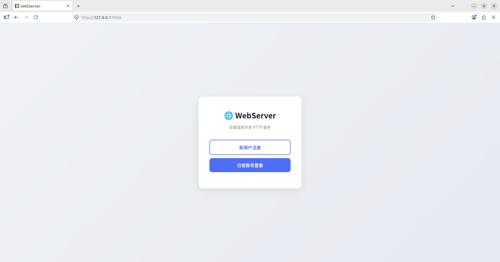
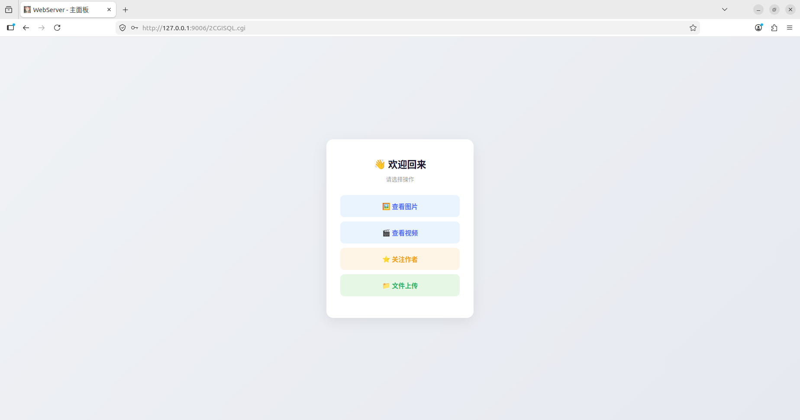
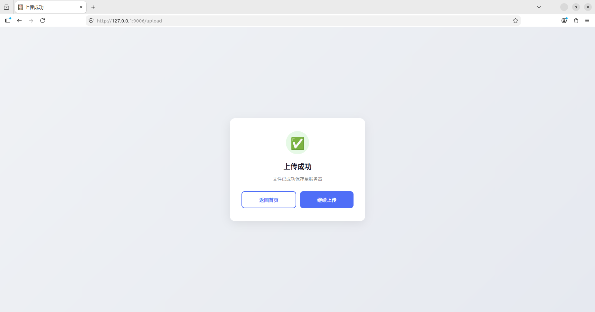

NovaServer
===============
[](https://github.com/ranbai7/NovaServer/actions/workflows/ci.yml)

Linux 下 C++ 轻量级 Web 服务器，并发模型为**主从 Reactor（one loop per thread）**：主线程只负责 accept，新连接按轮转策略分发给若干子 Reactor 线程，每个线程持有独立的 epoll 实例与事件循环；连接的文件描述符、协议解析状态与其超时定时器全部归属所属线程。在此基础上新增文件上传功能，并修复了静态资源 MIME 类型等实用性细节。

架构细节见 [docs/architecture.md](docs/architecture.md)。

> **项目来源**：本项目的架构设计参考自开源项目 [qinguoyi/TinyWebServer](https://github.com/qinguoyi/TinyWebServer)（MIT 协议），在其基础上进行二次开发与重构。原项目版权归原作者所有，详见 [LICENSE](LICENSE)。

## 新增功能 / 改进
- **文件上传**  
  支持 `multipart/form-data` 格式的文件上传，自动解析 boundary，提取文件名与内容，保存至 `./upload/` 目录，并返回用户友好的成功页面。
- **全站界面美化**  
  重新设计所有 HTML 页面（登录、注册、主面板、上传、成功提示等），使用统一的现代卡片式布局，配色简洁，交互流畅。
- **MIME 类型支持**  
  增加了基于文件扩展名的 MIME 类型映射（`get_mime_type`），为静态资源响应添加正确的 `Content-Type` 头，解决了部分浏览器直接显示 HTML 源码或乱码的问题。
- **上传路径安全**  
  上传文件名自动去除路径前缀，防止目录穿越攻击。
- **上传文件可访问**  
  上传内容可通过 `/upload` 列出、`/upload/<文件名>` 下载，下载一律按附件处理。上传类型受扩展名白名单约束（不接受 `.html` / `.svg` / `.js` 等可携带脚本的类型），单文件体积上限 4 MiB。
- **静态资源路径规范化**  
  请求路径先解码 `%XX` 再规范化，越出站点根目录的路径被拒绝，避免任意文件读取。
- **口令加盐哈希**  
  注册与登录使用 PBKDF2-HMAC-SHA256 校验，库中不保存明文；历史明文记录在启动时自动升级。
- **路由扩展**  
  新增 `/8`（上传页面）和 `/upload`（上传接口）路由，与原有登录/注册/图片视频等功能无缝集成。

---
## 项目特性

* 并发模型为**主从 Reactor（one loop per thread）**：主线程只 accept，新连接按轮转策略分发给子 Reactor 线程
* 事件源统一为 **epoll + timerfd + eventfd + signalfd**：定时器、跨线程唤醒与退出信号都是文件描述符，没有信号处理函数
* 使用**状态机**解析 HTTP 请求报文，支持 **GET / POST / HEAD**
* 访问服务器数据库实现 web 端用户**注册、登录**功能，口令以 PBKDF2-HMAC-SHA256 加盐哈希保存，不保存明文
* 实现**同步/异步日志系统**：异步写入下，调用线程只把整行日志追加进线程私有缓冲，由专门的写盘线程按缓冲块批量落盘，写入路径上不再逐行产生系统调用
* 支持 `multipart/form-data` 文件上传，上传内容受扩展名白名单与体积上限约束，下载一律按附件处理
* 单元测试覆盖路径规范化、配置解析、事件循环、定时器队列等模块


目录
-----

| [概述](#概述) | [框架](#框架) | [界面展示](#界面展示) | [压力测试](#压力测试) | [快速运行](#快速运行) | [个性化运行](#个性化运行) | [致谢](#致谢) |
|:--------:|:--------:|:--------:|:--------:|:--------:|:--------:|:--------:|


概述
----------

> * C/C++，B/S 模型
> * [事件循环与通道](net/event_loop.h) — epoll 实例、跨线程唤醒、待执行任务队列
> * [监听器](net/acceptor.h) — 监听套接字、接受新连接、描述符耗尽的兜底
> * [连接](net/tcp_connection.h) — 连接生命周期、读写处理、持有协议对象
> * [子 Reactor 线程池](net/event_loop_thread_pool.h) — 子线程与轮转分配
> * [定时器队列](net/timer_queue.h) — 基于 timerfd 的空闲连接回收
> * [http 连接请求处理类](http/http_conn.h) — 状态机解析与响应组装
> * [同步/异步日志系统](log/log.h) — 缓冲池批量落盘、按日期与行数轮转
> * [数据库连接池](CGImysql/sql_connection_pool.h)
> * [并发原语包装类](lock/locker.h)
> * [简易服务器压力测试](test_pressure/)


框架
-------------

各模块的职责划分、连接的归属约定与一次请求的事件流，见 [docs/architecture.md](docs/architecture.md)。

界面展示
----------
> * 首界面

<div align=center> </div>

> * 注册界面

<div align=center> </div>

> * 登录界面

<div align=center> </div>

> * 欢迎界面

<div align=center> </div>

> * 图片展示界面

<div align=center> </div>

> * 视频播放界面

<div align=center> </div>

> * 文件上传界面

<div align=center> </div>

> * 文件上传成功界面

<div align=center> </div>

压力测试
-------------

工具为 `wrk`，`-c100`，服务端以 `-c 1` 关闭日志，每组 5 次取中位数。子 Reactor 线程数的影响：

| `-t` | QPS | P50 (ms) | P99 (ms) |
|--:|--:|--:|--:|
| 0（单循环，对照） | 29825 | 3.31 | 4.82 |
| 1 | 27868 | 3.34 | 16.12 |
| **2** | **50270** | **1.96** | **2.75** |
| 4 | 37705 | 2.50 | 8.22 |

测试机的 4 个 vCPU 实为 2 物理核 + 超线程，且 wrk 与服务端同机，因此 2 个子线程即已占满可用并行度，更多线程反而带来调度开销。完整的环境说明与数据见 [docs/changes/029-uninit-mapping-crash.md](docs/changes/029-uninit-mapping-crash.md)；重构前的基线见 [docs/changes/021-baseline-after-fixes.md](docs/changes/021-baseline-after-fixes.md)；与重构前基线在同一时段做的对照见 [docs/changes/031-baseline-comparison.md](docs/changes/031-baseline-comparison.md)。

压测脚本见 [test_pressure/bench.sh](test_pressure/bench.sh)。


快速运行
------------
* 服务器测试环境
	* Ubuntu版本16.04
	* MySQL版本5.7.29
* 浏览器测试环境
	* Windows、Linux均可
	* Chrome
	* FireFox
	* 其他浏览器暂无测试

* 测试前确认已安装MySQL数据库

    ```C++
    // 建立yourdb库
    create database yourdb;

    // 创建user表
    USE yourdb;
    CREATE TABLE user(
        username char(50) NULL,
        passwd varchar(255) NULL
    )ENGINE=InnoDB;

    // 添加数据
    INSERT INTO user(username, passwd) VALUES('name', 'passwd');
    ```

    口令在库中以**加盐哈希**（PBKDF2-HMAC-SHA256）保存。直接插入明文同样可用：服务端启动时会把明文记录自动升级为哈希，并在需要时把 `passwd` 列加宽到 `varchar(255)`，因此上述建表语句即使沿用旧的 `char(50)` 也能自动修正。

* 准备配置文件

    仓库提供 `config.example.ini` 作为模板，其中包含监听端口、数据库连接、日志等全部可配置项。复制并按实际环境修改，**数据库口令写在这里而不是源码中**：

    ```bash
    cp config.example.ini config.ini
    # 编辑 config.ini 中的 [database] 一节
    ```

    `config.ini` 已被 `.gitignore` 忽略，不会被提交。命令行参数优先于配置文件，因此可以两者混用——把口令放在配置文件中，临时换端口时用 `-p` 覆盖。各配置项的含义见 `config.example.ini` 内的注释。

* build

    ```C++
    sh ./build.sh
    ```

* 启动server

    ```C++
    ./build/server
    ```

* 浏览器端

    ```C++
    ip:9006
    ```

运行测试
------
单元测试依赖 GoogleTest，首次使用需先安装：

```bash
sudo apt install libgtest-dev
```

执行全部测试：

```bash
cmake -B build -DCMAKE_BUILD_TYPE=Release
cmake --build build
ctest --test-dir build --output-on-failure
```

个性化运行
------

```C++
./build/server [-p port] [-l LOGWrite] [-m TRIGMode] [-o OPT_LINGER] [-s sql_num] [-t thread_num] [-c close_log] [-f config_file]
```

温馨提示:以上参数不是非必须，不用全部使用，根据个人情况搭配选用即可.
未给出的参数取自配置文件（默认 `./config.ini`，不存在时回退到内置默认值）。

* -p，自定义端口号
	* 默认9006
* -l，选择日志写入方式，默认异步写入
	* 0，同步写入：每写一行就落盘。进程崩溃不丢日志，代价是每行的写入开销都压在调用线程上
	* 1，异步写入：写入线程私有的缓冲，由专门的写盘线程按整块批量落盘。代价是进程被 SIGKILL 或崩溃时，最多丢掉 `flush_interval` 内的日志（优雅退出仍完整落盘）
* -m，listenfd和connfd的模式组合，默认使用LT + LT
	* 0，表示使用LT + LT
	* 1，表示使用LT + ET
    * 2，表示使用ET + LT
    * 3，表示使用ET + ET
* -o，优雅关闭连接，默认不使用
	* 0，不使用
	* 1，使用
* -s，数据库连接数量
	* 默认为8
* -t，子 Reactor 线程数
	* 默认为8
	* 0 表示不建子线程，全部连接归主循环（用于与多线程分发对照）
* -c，关闭日志，默认打开
	* 0，打开日志
	* 1，关闭日志
* -f，指定配置文件路径
	* 默认 `./config.ini`，文件不存在时使用内置默认值
	* 显式指定却找不到文件时终止启动

测试示例命令与含义

```C++
./build/server -p 9007 -l 1 -m 0 -o 1 -s 10 -t 4 -c 1
```

- [x] 端口9007
- [x] 异步写入日志
- [x] 使用LT + LT组合
- [x] 使用优雅关闭连接
- [x] 数据库连接池内有10条连接
- [x] 4 个子 Reactor 线程
- [x] 关闭日志

日志配置
------

`[log]` 节的各项取值见 [config.example.ini](config.example.ini) 内的注释，其中几项有取值范围限制，
越界会在启动阶段直接报错而不是静默夹取：

| 键 | 默认值 | 有效范围 | 说明 |
|:--|--:|:--|:--|
| `write_mode` | 1 | 0 或 1 | 0 = 同步（每行落盘），1 = 异步（批量落盘） |
| `buf_size` | 2000 | 128 ~ 4096 | 单条日志的长度上限，超出会被截断 |
| `split_lines` | 800000 | ≥ 1 | 单个文件的行数**软**上限：写入以整块为单位，可能多出不到一块的行数 |
| `batch_buf_size` | 65536 | 4096 ~ 8388608 | 缓冲块大小。内存中最多保留 9 块，即日志的内存上界是它的 9 倍 |
| `flush_interval` | 1000 | 1 ~ 3600000 | 异步写入的定时刷新间隔（毫秒） |

写盘速度跟不上时，实现会丢弃新行并在日志里写下「已丢弃 N 行」，使丢失可见而不是无声无息。

致谢
------------
本项目基于 qinguoyi/TinyWebServer 进行二次开发，只用于自主学习，遵守原项目许可证。
十分感谢原作者的开源，如果你觉得有帮助，欢迎给原项目点个 Star⭐️。


