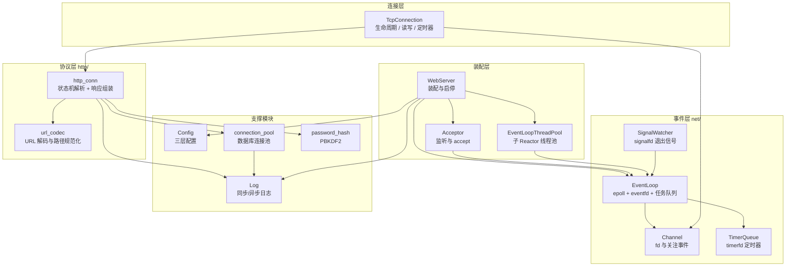
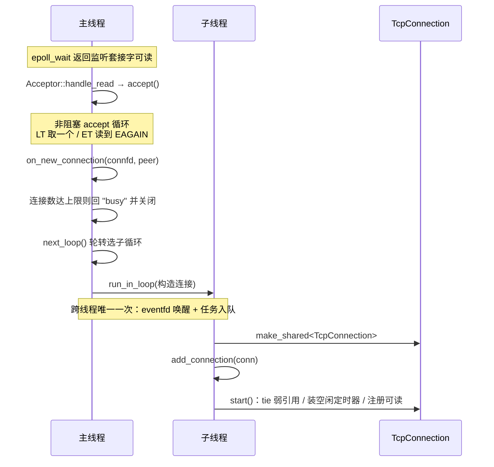
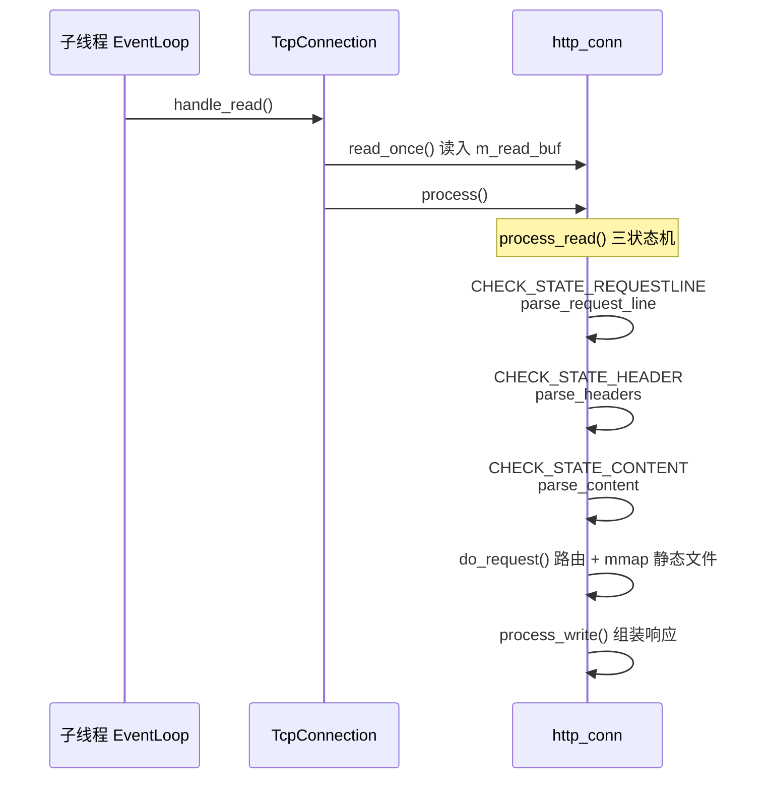
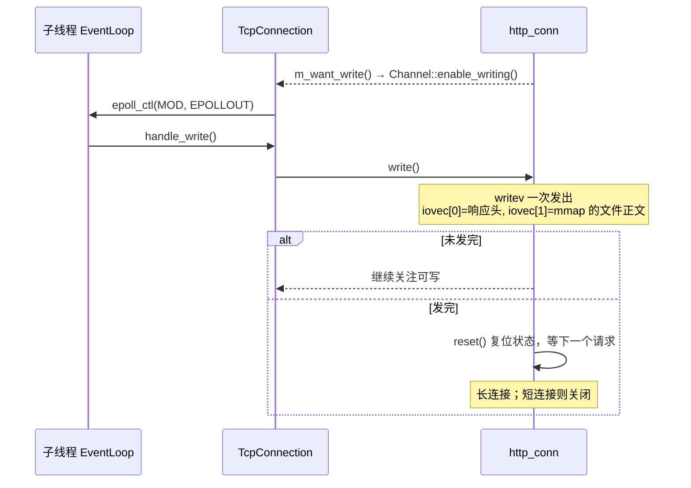

# 01 · 项目总览

> **本章讲什么**：这个项目是什么、由哪些部分组成、一次请求从头到尾经过了哪些环节。读完本章应当能在脑中画出完整的架构图与数据流。
>
> 后续各章都是本章某个局部的展开。
> **对应源码**：项目根目录与 `net/`、`http/`

---

## 速览

1. **它是一个 Linux 下的 C++ 轻量级 Web 服务器**，实现了 HTTP/1.1 的静态资源服务、用户注册登录（MySQL）、文件上传三大功能。
2. **架构是主从 Reactor（one loop per thread）**：主线程只 `accept`，连接按轮转分发给若干子 Reactor 线程，每个子线程有独立的 `epoll` 与事件循环。
3. **所有需要等待的外部输入都收敛为文件描述符**：`epoll` + `timerfd`（空闲回收）+ `eventfd`（跨线程唤醒）+ `signalfd`（退出信号）。**全项目没有信号处理函数。**
4. **它基于开源项目 TinyWebServer 二次开发**：原版是半同步/半反应堆模型，本项目重写了并发模型、日志系统、内存管理，并补齐了协议完整性与验证体系。
5. **分四层**：装配层（`WebServer`）→ 事件层（`net/`）→ 连接层（`TcpConnection`）→ 协议层（`http_conn`），另有日志、配置、数据库连接池、口令哈希四个支撑模块。
6. **有完整的验证设施**：7 个 GoogleTest 测试目标、GitHub Actions CI、ASan/TSan 动态检查、可复现的压测脚本与同时段 A/B 对照数据。

---

## 一、项目是什么

### 1.1 定位与来源

NovaServer 是一个运行在 Linux 上的 C++ 轻量级 Web 服务器，面向**学习与展示**：它不追求功能完备（没有 HTTPS、没有反向代理、没有会话管理），而是把服务端并发编程的**主干问题**做扎实——并发模型、连接生命周期、协议实现、资源管理、性能度量。

项目基于开源项目 [qinguoyi/TinyWebServer](https://github.com/qinguoyi/TinyWebServer)（MIT 协议）二次开发。原项目实现了一个可用的半同步/半反应堆服务器，本项目在其基础上完成了四个阶段的改造：

| 阶段 | 主题 | 主要产出 |
|:--|:--|:--|
| 零 | 建立性能基线 | 四项可对比指标 |
| 一 | 工程基础与代码规范 | CMake / C++17 / 单元测试 / CI |
| 二 | 正确性与协议完整性 | 修 28 项问题 + 一次独立核查再查出 12 项 |
| 三 | 并发模型重构 | 主从 Reactor（见 [03](03-并发模型重构.md)） |
| 四 | 性能优化与验证 | 日志双缓冲、ASan/TSan 全链路 |

最终产出 35 份变更记录、7 个测试目标，以及一套可复现的性能对照数据。**改造前后**：默认配置 QPS 19808 → 33151（+67%），P99 延迟 899.99 ms → 16.79 ms，常驻内存 262.8 MB → 12.6 MB。

### 1.2 技术栈与运行环境

| 项 | 取值 |
|:--|:--|
| 语言标准 | **C++17** |
| 操作系统 | Linux（在 Ubuntu 22.04 / 内核 6.8 上开发验证） |
| 构建 | CMake ≥ 3.16（`cmake -B build` + `cmake --build build`） |
| 网络 | `epoll` + `timerfd` + `eventfd` + `signalfd` |
| 数据库 | MySQL（客户端库 `libmysqlclient`） |
| 加密 | OpenSSL（PBKDF2-HMAC-SHA256） |
| 测试 | GoogleTest + GitHub Actions + AddressSanitizer / ThreadSanitizer |
| 压测 | `wrk` + `webbench` |

**没有用到的东西**（同样值得记）：没有 Boost/Asio 等第三方网络库（网络层全部手写），没有 JSON 库（配置是自写的 INI 解析），没有连接池以外的中间件。

---

## 二、整体架构

### 2.1 分层



**每层的职责边界**（这条比图更重要）：

| 层 | 只负责 | 不负责 |
|:--|:--|:--|
| 事件层 | 「有哪些 fd 就绪了、该调用谁」 | 不知道 HTTP 是什么 |
| 连接层 | 「这个连接的生死、读写时机、超时」 | 不知道请求内容是什么 |
| 协议层 | 「这段字节流是什么请求、该回什么响应」 | **不认识 `epoll`**（只通过回调表达「想读 / 想写」） |
| 装配层 | 「把这些组件装起来、连起来」 | 不处理单个请求 |

### 2.2 模块地图

| 模块 | 文件 | 职责 | 详见 |
|:--|:--|:--|:--|
| 入口 | `main.cpp` | 屏蔽退出信号 → 解析配置 → 初始化 → 启动 | 本章 §六 |
| 装配 | `webserver.{h,cpp}` | 服务器主类：装配组件，处理新连接与连接关闭 | [03](03-并发模型重构.md) |
| 网络 | `net/event_loop.{h,cpp}` | 单线程事件循环：epoll、eventfd 唤醒、跨线程任务队列、连接注册表 | [03](03-并发模型重构.md) |
| 网络 | `net/channel.{h,cpp}` | fd 与关注事件的绑定，维护 `epoll_ctl` 的 ADD/MOD/DEL | [03](03-并发模型重构.md) |
| 网络 | `net/acceptor.{h,cpp}` | 监听套接字、接受新连接、描述符耗尽兜底 | [03](03-并发模型重构.md) |
| 网络 | `net/tcp_connection.{h,cpp}` | 连接生命周期、读写处理、空闲定时器 | [05](05-生命周期与资源管理.md) |
| 网络 | `net/event_loop_thread_pool.{h,cpp}` | 子 Reactor 线程池与轮转分配 | [03](03-并发模型重构.md) |
| 网络 | `net/timer_queue.{h,cpp}` | 基于 `timerfd` 的定时器队列 | [04](04-事件源统一.md) |
| 网络 | `net/signal_watcher.{h,cpp}` | 以 `signalfd` 接管退出信号 | [04](04-事件源统一.md) |
| 网络 | `net/socket_utils.{h,cpp}` | 非阻塞设置等无状态工具 | — |
| 协议 | `http/http_conn.{h,cpp}` | HTTP 状态机解析与响应组装（1600+ 行，全项目最大文件） | [06](06-协议实现.md) |
| 协议 | `http/url_codec.h` | URL 解码与路径规范化（已提取为可单测的纯函数） | [06](06-协议实现.md) |
| 日志 | `log/log.{h,cpp}` | 单例日志：批量落盘、按日期与行数轮转、同步/异步两种写入 | [08](08-日志系统.md) |
| 配置 | `config.{h,cpp}` | 三层配置来源：默认值 < 配置文件 < 命令行 | [09](09-工程基础.md) |
| 安全 | `auth/password_hash.{h,cpp}` | PBKDF2-HMAC-SHA256 | [07](07-安全加固.md) |
| 数据库 | `CGImysql/sql_connection_pool.{h,cpp}` | 连接池单例，RAII 方式借用与归还 | [07](07-安全加固.md) |
| 并发原语 | `lock/locker.h` | 互斥量、条件变量、信号量的 RAII 包装 | [08](08-日志系统.md) |

### 2.3 运行期的线程数

```
线程总数 = 1（主 Reactor）+ N（子 Reactor，由 -t 指定）+ 1（日志写盘线程）
```

日志写盘线程**不属于任何事件循环**：它不参与 IO，只按缓冲块写满或定时到点把日志成块落盘（见 [08](08-日志系统.md)）。`-t 0` 时只有主线程与写盘线程。

---

## 三、核心链路：一次请求的完整旅程

这是本章最需要记住的部分。以一次普通的静态资源请求 `GET /judge.html` 为例。

### 3.1 建立连接（主线程 → 子线程）



**关键点**：跨线程传递的只有 `connfd` 与对端地址。连接的构造、注册与启动全部在**它归属的线程**内完成——这是整个并发模型的地基。

### 3.2 读取与解析（协议状态机）



**状态机**是协议层的核心：`parse_line()` 在缓冲区里找 `\r\n`，找到就交给当前状态的解析函数，处理完推进到下一个状态。找不到完整行就返回 `LINE_OPEN`，等下一次读事件把数据补齐——**解析状态保存在连接对象里**，因此必须随连接一同归属于某个线程。

### 3.3 路由

`do_request()` 按 URL 决定做什么。这张表把当前全部路由列全了：

| 请求 | 行为 |
|:--|:--|
| `GET /` | 返回 `judge.html`（首页） |
| `GET /0` | 返回 `register.html` |
| `GET /1` | 返回 `log.html` |
| `GET /5` / `/6` / `/7` | 返回 `picture.html` / `video.html` / `fans.html` |
| `GET /8` | 返回 `upload.html`（上传页） |
| `POST /2` | **登录**：查库校验口令哈希 → 跳 `/welcome.html` 或 `/logError.html` |
| `POST /3` | **注册**：查重后写入 → 跳 `/log.html` 或 `/registerError.html` |
| `GET /upload` | 列出已上传文件 |
| `POST /upload` | **上传**：解析 `multipart/form-data`，落盘到 `./upload/` |
| `GET /upload/<name>` | **下载**已上传文件（一律加 `Content-Disposition: attachment`） |
| 其他 | 按静态资源处理：解码 → 规范化 → 校验在根目录内 → `stat` → `mmap` |

**注意 `/2` `/3` 的处理方式**：它们不是独立模块，而是把 `m_url` **改写**成一个跳转页面路径，随后走同一套静态映射逻辑。这是原项目的做法，本项目保留了这个结构（但把参数解析从固定偏移改成了通用键值解析，见 [07](07-安全加固.md)）。

### 3.4 发送响应



**零拷贝点**：静态文件的正文不经过用户态缓冲，而是 `mmap` 到内存后由 `writev` 直接从映射发出。

### 3.5 收尾

连接关闭的五个触发点（读失败 / 处理失败 / 写失败 / 对端关闭 / 空闲超时）全部汇聚到 `TcpConnection::close()`，释放顺序为「取消定时器 → `unmap` → `EPOLL_CTL_DEL` → `close(fd)`」。详见 [05](05-生命周期与资源管理.md)。

---

## 四、关键数据在层间的形态

| 阶段 | 形态 | 归属 |
|:--|:--|:--|
| 跨线程投递 | `int connfd` + `sockaddr_in peer` | 主线程 → 子线程，仅此一次 |
| 读入 | `m_read_buf`（`std::vector<char>`，按需扩容，初值 2048 字节） | 协议层 |
| 解析中 | 指向读缓冲的裸指针（`m_url` / `m_host`）+ 游标（`m_checked_idx`） | 协议层；**指针不拥有内存** |
| 路由产物 | `m_real_file[200]`（根目录 + 相对路径） | 协议层 |
| 静态正文 | `mmap` 得到的映射地址 + `stat` 的文件长度 | 协议层，随连接释放而 `munmap` |
| 响应 | `m_write_buf` + `iovec[2]` | 协议层 |
| 事件意图 | `m_want_read` / `m_want_write` 两个 `std::function` | 协议层 → 连接层的**唯一出口** |

---

## 五、术语约定

本资料与代码保持一致的叫法，避免同义替换造成歧义。

| 术语 | 含义 |
|:--|:--|
| **主 Reactor / 主循环** | 主线程的 `EventLoop`，只负责 `accept` |
| **子 Reactor / 子循环** | 子线程的 `EventLoop`，处理已建立连接的读写 |
| **连接归属** | 一个连接的 fd、协议状态、超时定时器全部只属于一个线程 |
| **事件源** | 任何能让 `epoll_wait` 返回的输入：socket、`timerfd`、`eventfd`、`signalfd` |
| **触发模式** | `-m` 的取值，监听侧与连接侧各自的 LT/ET 组合 |
| **原项目 / 旧架构** | TinyWebServer 的半同步/半反应堆实现 |
| **本项目 / 新架构** | 二次开发后的主从 Reactor 实现 |
| **缓冲块** | 日志异步写入的落盘单位，默认 64 KiB |

---

## 六、跑起来

```bash
# 依赖
sudo apt install build-essential cmake libmysqlclient-dev libssl-dev libgtest-dev

# 数据库（口令以加盐哈希保存；明文插入也能用，启动时会自动升级）
mysql -e "CREATE DATABASE yourdb; USE yourdb;
          CREATE TABLE user(username char(50), passwd varchar(255)) ENGINE=InnoDB;"

# 配置（config.ini 已被 .gitignore 忽略，数据库口令写在这里而不是源码中）
cp config.example.ini config.ini && vi config.ini

# 构建与运行（**须在仓库根目录下启动**，站点/日志/上传目录都是相对路径）
sh ./build.sh && ./build/server

# 测试
ctest --test-dir build --output-on-failure
```

常用参数：

| 参数 | 含义 | 默认 |
|:--|:--|--:|
| `-p` | 监听端口 | 9006 |
| `-t` | 子 Reactor 线程数（`0` = 全归主循环，用于对照） | 8 |
| `-m` | 触发模式组合（0 = LT+LT … 3 = ET+ET） | 0 |
| `-l` | 日志写入方式（0 = 同步，1 = 异步） | 1 |
| `-s` | 数据库连接池大小 | 8 |
| `-f` | 配置文件路径 | `./config.ini` |

`Ctrl+C` 或 `SIGTERM` 可优雅退出，退出码为 0 且日志完整落盘。

---

## 七、怎么读这份资料

三条路径，按需要选：

**① 快速通读（约 1 天）**：本章 → [03 并发模型](03-并发模型重构.md) → [10 性能度量](10-性能度量.md)。抓住「架构是什么、为什么这么设计、效果如何」。

**② 完整学习（约 5~7 天）**：按编号 01 → 12 顺序读。每章末尾的「通用知识」是脱离本项目仍然成立的部分，值得单独过一遍。

**③ 按需查阅**：用 [11 知识点索引](11-知识点索引.md) 从「想了解的知识点」反查章节，或用 [12 附录](12-附录.md) 的「源码文件地图」从文件反查章节。

**与仓库其他文档的分工**：

| 文档 | 视角 | 什么时候看 |
|:--|:--|:--|
| [README](../README.md) | 使用者 | 想构建、配置、运行 |
| [architecture.md](../architecture.md) | 事实描述 | 想知道**现状是什么** |
| [summary.md](../summary.md) | 时间线 | 想知道**优化按什么顺序做的** |
| [performance.md](../performance.md) | 数据 | 想知道**每个数字的出处** |
| **本资料** | 学习 | 想知道**为什么这样设计、能学到什么** |

---

## 八、延伸阅读

| 想深入了解 | 去看 |
|:--|:--|
| 并发模型为什么这么设计 | [03 · 并发模型重构](03-并发模型重构.md) |
| 定时器、唤醒、退出信号的实现 | [04 · 事件源统一](04-事件源统一.md) |
| 连接的生死与资源管理 | [05 · 生命周期与资源管理](05-生命周期与资源管理.md) |
| HTTP 状态机与协议完整性 | [06 · 协议实现](06-协议实现.md) |
| 架构的完整事实描述 | [architecture.md](../architecture.md) |
| 全部源码位置 | [12 · 附录](12-附录.md) |

---

**下一章**：[02 · 原项目解析](02-原项目解析.md) —— 原版 TinyWebServer 长什么样、它的设计在什么条件下成立、又在哪里失效。
