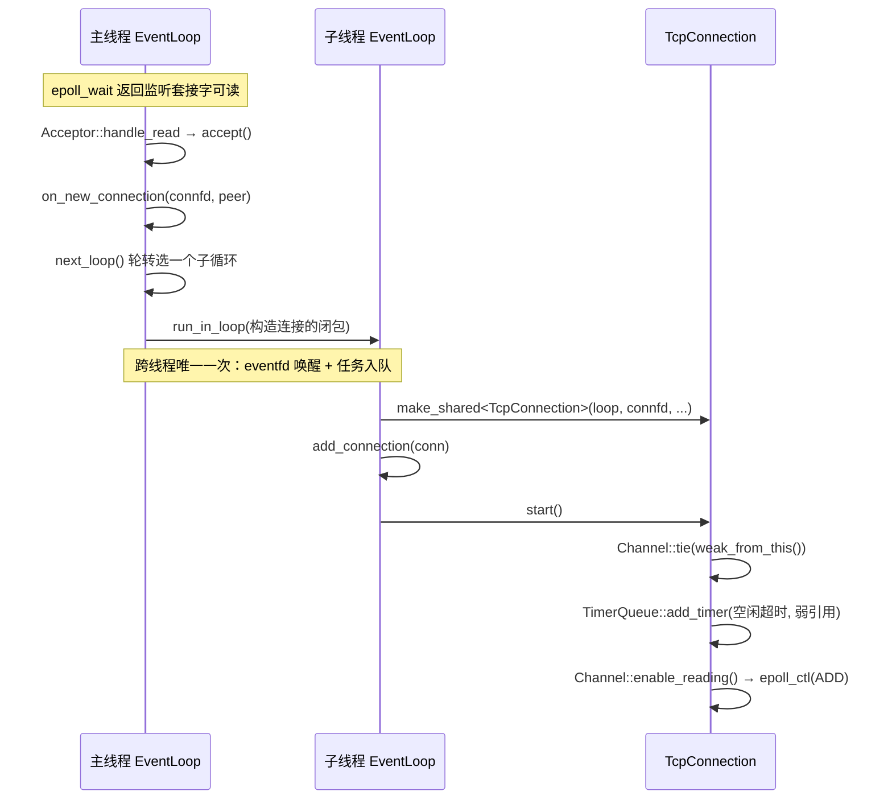
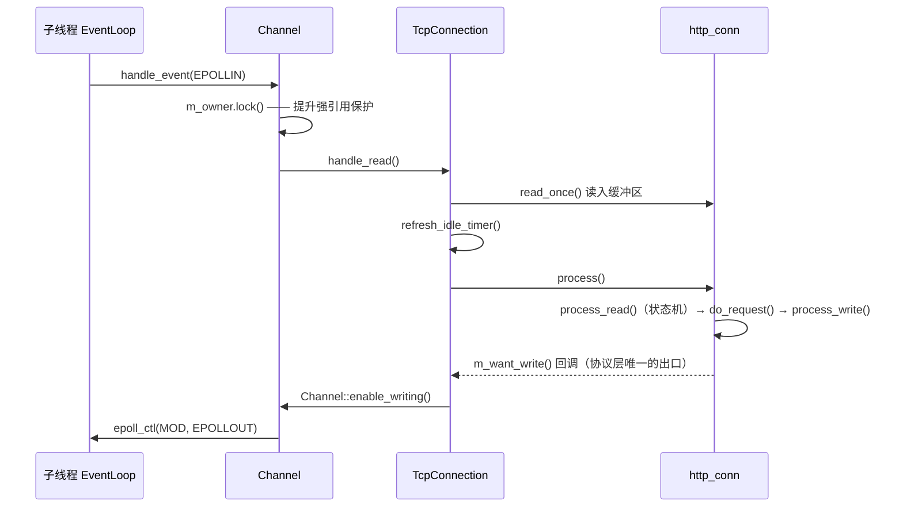
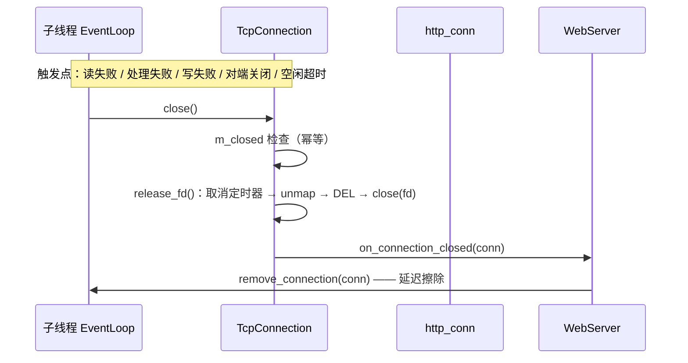

# 03 · 并发模型重构：从半同步/半反应堆到主从 Reactor

> **本章讲什么**：服务器最核心的一个决定——**谁来处理哪个连接、在哪个线程处理**。这是整个二次开发中最大的一块，也是唯一无法靠打补丁解决的部分。
>
> **对应源码**：`net/` 全目录、`webserver.cpp`、`http/http_conn.{h,cpp}` 的事件通知部分
> **对应记录**：`docs/changes/022`、`024`、`025`、`026`、`027`、`029`

---

## 速览

1. **原模型的病根不是「慢」，是「没有归属约定」**——同一连接的读事件与写事件可能落在不同线程，于是必须用 `EPOLLONESHOT` 抑制重复投递、用主线程轮询标志位确认完成。两个附加机制带来了 CPU 空转与跨线程可见性问题。
2. **新模型用一条结构约定取代了上述全部机制**：一个连接的文件描述符、协议解析状态、超时定时器**全部归属同一个线程**。约定成立后，「同一连接的读写串行」是结构推论，不再需要任何运行时防重入手段。
3. **跨线程只发生一次**：主线程 accept 后，把「描述符 + 对端地址」投递到目标子线程，此后该连接的一切都在那个线程内完成。
4. **连接关闭收敛为唯一出口且幂等**，五个触发点共用同一个 `close()`。
5. **效果**：常驻内存 60 MB → 12.6 MB；`-t 2` 下 QPS +59%；线程数从「对吞吐无影响」变为「显著正相关」，说明分工真正生效。
6. **代价**：`-t 1` 下吞吐回退 12%~15%——新架构为每个连接维护独立的定时器与事件源，单线程开销高于旧模型。这是明确的取舍，默认的 `-t 2` 才是最优点。

---

## 一、背景知识速查

| 概念 | 一句话 | 关键点 |
|:--|:--|:--|
| **epoll 三件套** | `epoll_create1` 建实例，`epoll_ctl` 增删改关注的事件，`epoll_wait` 阻塞到有事件就绪 | 事件驱动替代「一连接一线程」，避免线程阻塞在 `recv` 上 |
| **LT / ET** | LT 是「条件满足就持续通知」，ET 是「只在状态变化时通知一次」 | ET 下**必须一次读到 `EAGAIN`**，否则残留数据永不触发通知。`-m` 参数就是这两者的组合 |
| **Reactor** | 事件分发器等待事件并分派给处理器 | 三个角色：`EventLoop`（分发器）/ `Channel`（事件源绑定）/ `TcpConnection`（处理器） |
| **Proactor** | 内核完成读写后通知「读完了」 | Linux `epoll` 是**就绪**通知不是完成通知，纯 Proactor 在 Linux 上并不自然 |
| **one loop per thread** | 每个线程一个事件循环 | 隐含的分量更大的是：**一个对象只属于一个线程**，于是不需要锁 |
| **主从 Reactor** | 主循环只 accept，子循环处理连接 | 隔离 `accept` 与请求处理，让主线程随时能接新连接 |

**LT 与 ET 的取舍**：LT 编程简单（读不完下次还会通知），代价是就绪事件可能被反复唤醒；ET 效率更高，但要求一次读到 `EAGAIN`，漏读即死锁。本项目默认用 LT + LT，`-m` 可切到其他组合。

---

## 二、S · 背景：原模型的结构性问题

原项目（TinyWebServer）采用**半同步 / 半反应堆**模型：主线程同步 `accept`，工作线程异步处理已就绪的连接；`-a` 参数决定工作线程是「只处理业务、读写由主线程做」（Reactor）还是「连读写一起做」（Proactor）。

```
主线程：epoll_wait → 就绪事件 → 把连接塞进线程池任务队列
                                 │
工作线程 × N：从队列取任务 → 解析请求 → 组装响应
              ↑
   主线程轮询 improv 标志位，等它处理完才能重新注册描述符
```

它能跑，低并发下也正常。问题是**正确性依赖运行时时序的偶然性，而不是结构性约束**。具体是三个结构性问题：

### 2.1 事件注册与生命周期分散在多个路径上

`http_conn` 自己持有 `static int m_epollfd`（**全局单例**），并在 7 处直接调用 `modfd` / `addfd` / `removefd`——协议解析代码与 epoll 事件注册深度耦合。

更麻烦的是关闭：`http_conn::close_conn()` 自己执行 `EPOLL_CTL_DEL` + `close()`，而定时器回调、主循环、工作线程里也各有释放路径。同一份状态散在若干处被修改，**无法回答「这个 fd 现在到底是活着还是已经关了」**。

### 2.2 主线程靠忙等标志位等待工作线程

主线程把事件交给工作线程后，需要知道「处理完没有」才能重新注册描述符。原实现在 `while (true)` 里**轮询** `improv` 标志位：

- **CPU 空转**：主线程持续占一个核
- **可见性无保证**：这个标志位是普通 `bool`，没有 `atomic`、没有内存屏障。多线程下「写线程改了、读线程马上能看到」在语言层面**没有任何保证**

### 2.3 释放路径重叠且不幂等

连接关闭与定时器回调都会释放同一个描述符，且缺少幂等保护。描述符被内核回收后可能立刻分配给新连接，一条迟到的释放就会**作用到别的连接上**。

### 2.4 归结

三个问题可以归结成一句：**没有统一的「连接归属」约定**。因为连接状态是多线程共享的，才需要 `EPOLLONESHOT`；因为完成信号要跨线程传递，才需要轮询标志位；因为释放路径分散，才容易重叠。

**要根治，必须换模型，而不是加锁。**

---

## 三、T · 目标

### 3.1 目标模型

<pre>
                    ┌───────────────────────────┐
   监听套接字 ──────▶│  主线程 EventLoop          │
                    │  · Acceptor（监听）        │
                    │  · SignalWatcher（退出信号）│
                    └───────────┬───────────────┘
                                │ run_in_loop（按轮转投递）
              ┌─────────────────┼─────────────────┐
              ▼                 ▼                 ▼
     ┌────────────────┐ ┌────────────────┐ ┌────────────────┐
     │ 子线程 EventLoop│ │ 子线程 EventLoop│ │ 子线程 EventLoop│
     │ · epoll        │ │ · epoll        │ │ · epoll        │
     │ · TimerQueue   │ │ · TimerQueue   │ │ · TimerQueue   │
     │ · TcpConnection│ │ · TcpConnection│ │ · TcpConnection│
     └────────────────┘ └────────────────┘ └────────────────┘
</pre>

`-t 0` 是**合法的退化配置**：不建子线程，全部连接归主循环。它存在的意义是做对照实验——「多线程分发到底有没有用」需要单线程基线。

### 3.2 核心约束

> **一个连接的文件描述符、协议解析状态与其超时定时器，全部归属同一个线程。**

这条约束成立之后：读写串行成为结构推论（无需 `EPOLLONESHOT`）；连接状态无共享（**不需要锁**）；定时器只在本线程访问，原实现「主线程遍历链表、工作线程修改链表」的竞争**在结构上不存在**。

这与「加锁保护共享数据」是两种思路：加锁是**事后补救**，归属约定是**事前消除**。后者更快，也更不容易出错。

### 3.3 明确不引入的抽象

成熟网络库（如 muduo）会提供 `Buffer`、`Poller`、`TcpServer` 等一整套抽象，本项目**有意不引入**其中若干项：

| 不引入 | 理由（一句话） |
|:--|:--|
| 通用 `Buffer` 类 | 协议对象已持有缓冲区，且状态机游标与之强耦合，抽象化会迫使协议层大改 |
| `Poller` 抽象基类 | 只有 epoll 一种实现，无需虚函数层 |
| 独立 `TcpServer` 类 | 只有一个监听端口，职责由 `WebServer` 直接承担 |
| 地址与套接字的 RAII 包装 | 仅一种使用场景，无状态自由函数即可 |

抽象的收益是「支持多种实现」，成本是「多一层间接、多一份要理解的代码」。**「能抽象」不等于「该抽象」**——只有一种实现时收益接近于零。

---

## 四、A · 做法

### 4.1 抽象层：EventLoop 与 Channel

`EventLoop` 是每个线程的事件循环，持有 `epoll` 实例、`eventfd`（跨线程唤醒）、待执行任务队列：

```cpp
void loop();                            // 循环主体，必须在创建它的线程调用
void quit();                            // 线程安全：置位后用 eventfd 叫醒循环
void run_in_loop(Functor cb);           // 本线程立即执行，否则入队并唤醒
void update_channel(Channel *channel);  // 依据 Channel 状态决定 ADD 还是 MOD
```

`run_in_loop` 是跨线程协作的**唯一入口**，语义是「确保这段代码在 loop 线程内执行」。

三个实现细节：

1. **`loop()` 不重置退出标志**——循环启动前调用 `quit()` 是合法的，重置会把那次请求丢掉。
2. **任务先在锁内整块换出、再在锁外执行**——任务本身可能再次 `queue_in_loop`，持锁执行会**自锁**。
3. **`epoll_wait` 用无限超时**（`-1`）——有了 `TimerQueue` 之后依然正确，定时器到点会通过 `timerfd` 主动唤醒循环（见 [04](04-事件源统一.md)）。

`Channel` 是「描述符 + 关注事件 + 就绪后调用谁」的绑定，两个设计要点：

- **只标识描述符，不拥有它**。关闭时机由所有者决定，`Channel` 只保证「关闭之前先把自己从事件表摘掉」。**`EPOLL_CTL_DEL` 必须先于 `close(fd)`**——描述符被内核复用后，迟到的 `DEL` 会作用到新连接上。
- **热路径上消除系统调用**：协议层在「请求没收全」时每个事件都要求关注可读，若无条件发 `EPOLL_CTL_MOD` 就会多出与请求数等量的系统调用，因此**先比较再更新**：

  ```cpp
  void Channel::enable_reading()
  {
      if (kReadEvent == m_events) return;   // 已是该状态，不发系统调用
      m_events = kReadEvent;
      update();
  }
  ```

`handle_event` 的分派顺序是**读 → 写 → 关闭**：`EPOLLRDHUP` 只表示对端关闭**写端**，接收缓冲区里可能还留着最后一个请求（通常与 `EPOLLIN` 一起返回），先走关闭会丢掉它。

### 4.2 唯一释放出口

五个触发点——**读失败、处理失败、写失败、对端关闭、空闲超时**——全部汇聚到 `close()`。入口唯一，幂等就成了廉价且必要的保证：

```cpp
void TcpConnection::close()
{
    if (m_closed) return;    // 多个触发点可能同轮到达
    m_closed = true;
    release_fd();
    if (m_close_callback) m_close_callback(shared_from_this());
}
```

实际释放拆到 `release_fd()`，因为**析构函数里不能调用 `shared_from_this()`**（对象已在销毁中）。释放顺序固定：

```
取消定时器 → unmap() → disable_all → Channel::remove() → ::close(fd)
```

`unmap()` 排前面，因为文件映射可能建立在一个**尚未写出响应**的请求上，那条路径不经过 `write()`。

### 4.3 生命周期保护：`tie` 与延迟擦除

这是 C++ 网络编程最容易踩的两处悬垂引用。

**（一）回调执行到一半，对象被释放了。** 关闭连接的回调从 `handle_event` 内部触发，而「关闭」往往意味着持有者的**最后一个 `shared_ptr` 被释放**。解法是在**分派点**统一加保护，而不是要求每个回调都记得先 `shared_from_this()`：

```cpp
// net/channel.cpp  handle_event()
std::shared_ptr<void> guard;
if (m_tied) {
    guard = m_owner.lock();
    if (!guard) return;      // 持有者已销毁，此事件不再有意义
}
```

类型取 `void` 是为了不依赖持有者的具体类型——`Channel` 不需要知道持有它的是谁。

**（二）从注册表擦除，擦掉了最后一份引用。** 关闭由连接自己的回调触发，若在回调栈内直接 `erase`，注册表持有的那份（可能是最后一份）引用会在**回调返回之前**析构对象。解法是**延迟擦除**——把擦除投递到任务队列，由循环下一轮执行：

```cpp
void EventLoop::remove_connection(const std::shared_ptr<void> &conn)
{
    queue_in_loop([this, conn] { m_connections.erase(conn); });   // 按值捕获，入队后再擦
}
```

### 4.4 线程池与轮转分发

`EventLoopThreadPool` 负责创建子 Reactor 线程并分发连接，三个设计点：

**（一）`EventLoop` 建在子线程自己的栈上。**

```cpp
void EventLoopThreadPool::thread_func(int index)
{
    EventLoop loop;      // 栈上，析构发生在本线程内
    ...
    loop.loop();
}
```

`EventLoop` 的析构会清空连接注册表，而后者可能持有连接的**最后一份引用**。建在子线程栈上，析构就发生在线程内——连接与定时器的最终释放也发生在**正确的线程**上。若由主线程持有并析构，就会在主线程释放别人的资源。

**（二）`start()` 阻塞到所有循环就绪**：用条件变量等到每个子线程都把自己的 `EventLoop` 指针填进 `m_loops` 才返回。此后 `next_loop()` 拿到的指针在运行期只读，**不再需要同步**。

**（三）连接的建立必须投递到目标线程。**

```cpp
EventLoop *loop = m_thread_pool->next_loop();
loop->run_in_loop([this, loop, connfd, peer] {
    const std::shared_ptr<TcpConnection> conn = std::make_shared<TcpConnection>(
        loop, connfd, peer, m_root, m_conn_trig_mode, m_close_log, m_connPool, IDLE_TIMEOUT_MS);
    conn->set_close_callback(...);
    loop->add_connection(conn);   // 顺序固定：先登记
    conn->start();                // 再启动
});
```

`on_new_connection` 运行在主线程，而连接的**构造**必须发生在它归属的循环线程内，否则协议对象与 `Channel` 就跨越了两个线程。注意 `add_connection` 在 `start()` 之前：`start()` 注册的空闲定时器持有连接的**弱引用**，要求它此前已被 `shared_ptr` 持有。

**跨线程传递的，只有描述符与对端地址这一次。**

### 4.5 协议层解耦：只表达「关心什么」

原实现里 `http_conn` 自己调 `epoll_ctl`（7 处 `modfd`），与新架构的 `Channel` 重复注册、无法共存。改造办法是**注入两个回调**：

```cpp
// http/http_conn.h
using EventCallback = std::function<void()>;
void set_event_notifier(EventCallback want_read, EventCallback want_write);
```

`modfd(EPOLLIN)` 变成 `m_want_read()`，`modfd(EPOLLOUT)` 变成 `m_want_write()`，**协议层从此完全不认识 epoll 与 `Channel`**。

这个拆分之所以自然，是因为「请求没收全就继续读」「响应就绪就转去写」本来就是**解析逻辑的一部分**；而「怎么把意图变成 `epoll_ctl`」才是事件层的事。改动本身很小（注入回调 + 替换 5 处调用点，1662 行协议代码其余部分没动）——**耦合的代价不在于改起来难，而在于它把两件不同的事绑死在了一起**。

---

## 五、核心链路：一次请求在层间如何流动

这是本章最需要记住的部分。**层次划分**如下：

| 层 | 模块 | 输入 | 输出 |
|:--|:--|:--|:--|
| 装配层 | `WebServer` / `Acceptor` / `EventLoopThreadPool` | 新连接 | 把连接归属到某个循环 |
| 事件层 | `EventLoop` / `Channel` | 内核就绪事件 | 回调调用 |
| 连接层 | `TcpConnection` | 读 / 写 / 关闭事件 | 驱动协议层；管理定时器与释放 |
| 协议层 | `http_conn` | 字节流 | 响应字节流 **+ 事件意图**（想读还是想写） |

### 5.1 连接建立



### 5.2 读请求 → 组装响应



写路径对称：`handle_write()` → `http_conn::write()`（`writev` 发送）→ 未发完继续关注可写，发完则复位状态等下一个请求。

**注意这里的分工**：协议层只负责「解析出响应、表达接下来关心什么」；`Channel` 负责把它翻译成 `epoll_ctl`；`TcpConnection` 负责定时器与释放。三层各管一事，没有一层越界。

### 5.3 关闭



### 5.4 数据在层间的形态

| 阶段 | 数据形态 | 关键点 |
|:--|:--|:--|
| accept 之后 | `int connfd` + `sockaddr_in peer` | 跨线程只传这两样 |
| 读入 | `m_read_buf`（`std::vector<char>`，按需扩容） | 非固定长度，见 [06](06-协议实现.md) |
| 解析中 | `m_url` / `m_host` 等**指向读缓冲的裸指针** + 游标 `m_checked_idx` | 指针不拥有内存，随缓冲扩容而重定位 |
| 响应 | `m_write_buf` + `iovec[2]`（`writev` 一次发头部与正文） | 静态文件用 `mmap`，正文零拷贝 |
| 事件意图 | `m_want_read` / `m_want_write` 两个 `std::function` | 协议层唯一的「出口」 |

---

## 六、关键接口与字段

### 6.1 关键接口

| 接口 | 位置 | 语义 | 为什么这样设计 |
|:--|:--|:--|:--|
| `run_in_loop(cb)` | `EventLoop` | 确保 `cb` 在 loop 线程内执行 | 跨线程协作的唯一入口：本线程直接跑，否则入队 + eventfd 唤醒 |
| `queue_in_loop(cb)` | `EventLoop` | 只入队，不立即执行 | 供「不能在当前栈内做」的场景（如延迟擦除） |
| `tie(weak_ptr)` | `Channel` | 绑定持有者弱引用 | 在**分派点**统一做生命周期保护，而非每个回调各自处理 |
| `set_event_notifier(r, w)` | `http_conn` | 注入「想读 / 想写」回调 | 让协议层不依赖 epoll，实现事件层与协议层解耦 |
| `close()` | `TcpConnection` | 唯一的释放出口 | 幂等，五个触发点共用 |
| `next_loop()` | `EventLoopThreadPool` | 轮转取一个子循环 | `std::atomic<int>` 自增取模，无锁 |

### 6.2 关键字段

| 字段 | 所在类 | 作用 | 设计要点 |
|:--|:--|:--|:--|
| `m_thread_id` | `EventLoop` | 标识循环所属线程 | `is_in_loop_thread()` 的依据；归属判定按**线程**而非「循环是否在跑」 |
| `m_wakeupfd` | `EventLoop` | `eventfd`，跨线程唤醒 | 单描述符 + 8 字节计数，比自管道简单 |
| `m_pending_functors` + `m_mutex` | `EventLoop` | 跨线程待执行任务 | 换出到锁外执行，避免任务再次入队时自锁 |
| `m_connections` | `EventLoop` | 连接注册表 | 元素类型 `std::shared_ptr<void>`，**避免事件循环依赖连接类型**；只在循环线程内访问，无需加锁 |
| `m_in_epoll` | `Channel` | 是否已在事件表中 | 决定 `epoll_ctl` 走 `ADD` 还是 `MOD` |
| `m_owner` / `m_tied` | `Channel` | 持有者弱引用 | `handle_event` 期间提升为强引用；`lock()` 失败则安静丢弃事件 |
| `m_trig_mode` | `Channel` | 触发模式 | 监听侧与连接侧可不同，故按对象设置；`epoll_events()` 在此位或上 `EPOLLET` |
| `m_closed` | `TcpConnection` | 幂等标志 | 五个关闭触发点可能同轮到达 |
| `m_timer_id` | `TcpConnection` | 空闲定时器句柄 | 不用 fd 下标——**fd 被内核复用后会命中另一条连接** |
| `m_want_read` / `m_want_write` | `http_conn` | 事件意图出口 | 缺省为空操作，未注入时退化为「什么也不做」而非抛 `bad_function_call` |
| `m_conn_count` | `WebServer` | 活跃连接数 | `std::atomic<long>`，替代原静态成员跨线程增减 |
| `m_idle_fd` | `Acceptor` | 预留的空闲描述符 | `EMFILE` 兜底的抓手，见 §七 |

---

## 七、R · 结果

### 7.1 先看不会被噪声干扰的证据

持续施压下采样各线程 CPU（两次读 `/proc/<pid>/task/*/stat` 取差）：

| 线程 | `-t 4` | `-t 0`（对照） |
|:--|--:|--:|
| 子线程 | 49.7% / 49.7% / 49.7% / 49.0% | — |
| 主线程（只 accept） | **0.0%** | **99.0%**（单核饱和） |

四个子线程负载几乎相同、主线程不再承担数据处理——**轮转分发是真实发生的**，而不是「参数改了但没生效」。这类结构性证据比 QPS 数字更值得引用。

### 7.2 性能数据

**重构前后的同时段 A/B**（把重构前的代码用 `git worktree` 重建，与当前代码同一时段背靠背测量，方法见 [10](10-性能度量.md)）：

| 配置 | 旧 QPS | 新 QPS | 变化 | 旧 RSS | 新 RSS |
|:--|--:|--:|--:|--:|--:|
| `-m 0 -t 8` | 29084 | **33426** | +15% | 60.0 MB | **12.6 MB** |
| `-m 0 -t 1` | 32246 | 27290 | **−15%** | 60.0 MB | 11.7 MB |
| `-m 0 -t 2` | 29663 | **47177** | **+59%** | 60.0 MB | 11.8 MB |
| `-m 0 -t 4` | 27901 | 32838 | +18% | 60.0 MB | 12.1 MB |

最值得注意的是 `-t 2`：**+59%**，且是在把 `-t` 从 8 降到 2 的同时取得的。旧架构下 `-t 1/2/4/8` 的 QPS 全挤在 19500~19800 之间（**参数几乎无影响**），新架构下 `-t 2` 相对 `-t 1` 提升七成以上。**从「无影响」到「显著正相关」，这才是重构生效的标志。**

### 7.3 代价与取舍

| 项 | 表现 | 解释 |
|:--|:--|:--|
| **`-t 1` 回退** | 两次独立测量均回退（−15% / −12.4%） | 新架构为**每个连接**维护独立的定时器与事件源，单线程开销高于旧的半同步模型 |
| **`-t 8` 的 P99 略高** | 9.57 ms → 16.79 ms | 旧架构 `-t 8` 时 `-t` **实际未生效**，其 P99 不可与新架构同名配置类比。**此项尚无定论** |
| **4 vCPU 限制** | `-t 2` 即封顶 | 测试机是 2 物理核 + 超线程，`wrk` 与服务端同机竞争。换硬件后最优线程数会变 |

> **「`-t 2` 最优」是有强烈环境成分的结论**，不能当普适规律搬走。

---

## 八、崩溃定位：一次完整的工程排查

阶段三期间发现并修复了一个**必现的崩溃**。它在新架构上被暴露（旧架构触发概率极低），定位过程本身是很好的教材。

### 8.1 现象

短连接施压（`wrk -c100 -H "Connection: close"`，4 秒内建立/关闭约 8 万条）：

| `-t` | 崩溃轮数 |
|--:|--:|
| 0 | 0/5 |
| 1 | **4/5** |
| 2 | **5/5** |
| 4 | 2/5 |

`-t 1` 就有 4/5 的崩溃率 → 问题位于**主线程与子线程的那条路径**上，不需要子线程间竞争。加大压力后 `-t 0` 也崩 → **不是多线程竞态，是确定性逻辑缺陷**，只是单线程下概率低。

崩溃点各不相同（`_int_malloc`、`epoll_ctl`、跳转到 `0x0`），是典型的**堆破坏**：破坏点与崩溃点分离。崩溃轮次 QPS 会先退化（6500 → 3672），说明破坏在**累积**。

### 8.2 一条重要的排除线：ASan 为什么没抓到

先试 AddressSanitizer，**14 轮以上零报告**。但 Release 下 2.6 万个请求就崩，而 ASan 下同等时间跑了约 6.5 万个请求——**不是概率不足**。

结论：**这一类破坏不在 ASan 的检查范围内**。ASan 查「越界访问」与「释放后使用」，而本例 `munmap` 的地址与长度都**合法**，只是**不属于自己**——这是语义错误，不是访问错误。

> **教训**：「ASan 干净」不能作为「没有内存问题」的证据。

### 8.3 根因

`http_conn` 构造函数**只初始化了两个事件通知器，其余成员全部未初始化**；而 `reset()` 的**第一步**就是 `unmap()`，它读 `m_file_address` 判断有没有待释放的映射——**读的是未初始化值**。

连接对象复用堆内存（`make_shared` 拿到的内存块残留上一个连接的取值，`malloc` 不清零），于是：

1. 连接 A 处理文件请求，`mmap` 得到地址 P，写入 `m_file_address`
2. 连接 A 关闭，`unmap()` 释放 P，对象析构，内存归还堆
3. 连接 B 复用同一块内存，`m_file_address` **残留着 P**
4. 连接 B 构造 → `reset()` → `unmap()` 读到 P → `munmap(P, 残留的 st_size)`

**这一步 `munmap` 解除的不是自己的映射**，那块地址可能已被重新用于堆扩展或 malloc arena。堆被无声破坏，直到很久以后某次 `malloc` 才暴露。这也解释了为什么**只有文件请求**是必要条件——只有走 `do_request` 的请求才会 `mmap`。

valgrind（`memcheck`）一击命中：

```
Conditional jump or move depends on uninitialised value(s)
   at unmap (http_conn.cpp:1193)
   by http_conn::reset() (http_conn.cpp:524)
```

> **教训二**：此前的困境不是分析不够，而是**工具不对**。翻查 45 轮不如换一个对的工具。

### 8.4 修复与验证

在构造函数里初始化相关成员（`m_file_address = nullptr`、`m_file_stat = {}` 等）即可。

| 项 | 修复前 | 修复后 |
|:--|:--|:--|
| 短连接 `-t 1` | 4/5 崩溃 | **0/10** |
| 短连接 `-t 0/2/4` | 0/5、5/5、2/5 | **0/15** |
| valgrind | 11 errors | **0 errors** |
| `SIGTERM` 退出码 | — | **0**（自行退出，非被信号杀死） |

性能**不降反升**（`-t 2` 45918 → 50530）：提升本身就是旁证——此前破坏持续累积、拖慢 `malloc`，现在这条损耗消失了。

### 8.5 TSan 又查出两处竞争

| 竞争 | 根因 | 修法 |
|:--|:--|:--|
| `localtime` 写全局静态缓冲区 | `localtime` **不是线程安全的**，首次调用还触发 `tzset` 改写全局时区状态 | 改用 `localtime_r`，并在单线程的 `Log::init()` 里先 `tzset()` 预热 |
| `m_fp` 判空在锁外 | 日志轮转时 `m_fp` 一度成为悬垂指针，另一线程在锁外读它判空 | 把判空移入锁内 |
| `m_root` 释放早于子线程退出 | `free(m_root)` 在析构**函数体**里，而 `m_thread_pool` 要等函数体之后才析构（由它 join 子线程） | 函数体开头先 `m_thread_pool.reset()` |

第三处正好呼应 §4.4 的析构顺序——`m_root` 至今仍是 `strdup`/`free` 而非 RAII 成员，原因就在这个**析构顺序约束**上（见 [05](05-生命周期与资源管理.md)）。

---

## 九、通用知识

**并发模型**

- Reactor / Proactor 的区别；Linux `epoll` 是**就绪**通知而非完成通知
- one loop per thread：主从 Reactor 的分工，以及「每线程一个循环」背后更重要的**对象归属约定**
- LT 与 ET 的语义差别；ET 下必须读到 `EAGAIN` 的原因
- **「结构保证」优于「机制保证」**：用归属约定消除共享，比用锁保护共享更彻底

**epoll 与网络编程**

- `epoll_create1` / `epoll_ctl` / `epoll_wait`；`ADD` 与 `MOD` 的语义区分
- **`EPOLL_CTL_DEL` 必须先于 `close(fd)`**——描述符复用是这类 bug 的根源
- `EPOLLRDHUP` 的半关闭语义，以及为什么关闭分派要放在读之后
- 非阻塞 `accept` 的正确循环：LT 取一个、ET 读到 `EAGAIN`，并处理 `EINTR` / `ECONNABORTED`
- **EMFILE 兜底**：ET 下 `accept` 因描述符耗尽失败后不再触发，服务会**永久失去接受能力**；预留一个空闲描述符（本项目用 `/dev/null`）+ accept 后立即关闭是标准解法
- `backlog` 的含义与 `SO_REUSEADDR`

**C++ 语言与对象模型**

- **`shared_ptr` / `weak_ptr`**：`lock()` 提升为强引用，用于「回调期间保证对象存活」与「对象已死则安静丢弃」
- **`shared_from_this()` 不能在析构函数里调用**，故释放逻辑拆到独立函数
- **`std::function` 与回调注入**：把「意图」与「实现」解耦
- **`std::atomic<int>` 的轮转计数**；普通 `bool` 做跨线程标志位不安全的原因
- **线程归属**：线程只应在自己栈上构建属于自己的对象
- 用局部作用域（`{ std::lock_guard ... }`）精确控制锁的持有范围

**工程方法**

- **优化必须给出代价**，且代价要能解释成因
- **结构性证据优先于性能数字**：线程 CPU 分布比 QPS 更能证明「分发生效了」
- **工具的能力边界**：ASan 查访问错误、valgrind 查未初始化值、TSan 查数据竞争——知道每种工具**查不了什么**，和知道它能查什么同样重要
- **复现先于结论**：未经复现的线索只能记作「未验证」

---

## 十、延伸阅读

| 想深入了解 | 去看 |
|:--|:--|
| `EventLoop` / `Channel` 的设计与单测 | [changes/022](../changes/022-event-loop-and-channel.md) |
| 主循环切换与协议层解耦 | [changes/024](../changes/024-single-loop-reactor.md) |
| 线程池与轮转分发的落地 | [changes/026](../changes/026-sub-reactor-thread-pool.md) |
| 崩溃的现象与定位过程 | [changes/027](../changes/027-short-connection-crash.md) |
| 崩溃根因、修复与 TSan 验证 | [changes/029](../changes/029-uninit-mapping-crash.md) |
| 线程模型的完整事实描述 | [architecture.md](../architecture.md) |
| 定时器、跨线程唤醒、退出信号 | [04 · 事件源统一](04-事件源统一.md) |
| 连接与内存的完整生命周期 | [05 · 生命周期与资源管理](05-生命周期与资源管理.md) |
| 性能数据的采集与解读方法 | [10 · 性能度量与验证](10-性能度量.md) |

---

**下一章**：[04 · 事件源统一](04-事件源统一.md) —— 定时器、跨线程唤醒、进程退出信号如何全部收敛为文件描述符，以及为什么「全项目没有信号处理函数」是一件好事。
