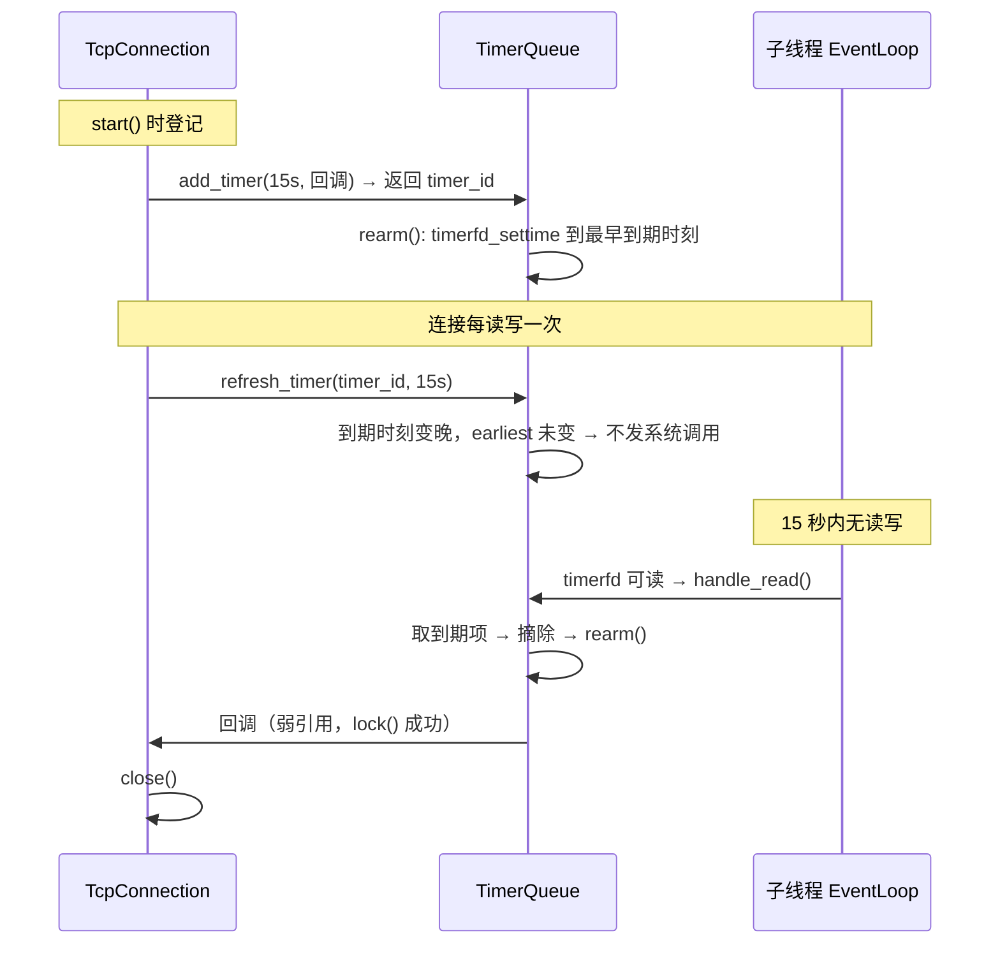

# 04 · 事件源统一

> **本章讲什么**：服务器要等待的外部输入有四种——网络事件、定时到点、跨线程唤醒、进程退出信号。本项目把这四种**全部收敛为文件描述符**，于是「全项目没有信号处理函数」。
>
> **对应源码**：`net/timer_queue.{h,cpp}`、`net/signal_watcher.{h,cpp}`、`net/event_loop.cpp` 的 eventfd 部分
> **对应记录**：`docs/changes/023`

---

## 速览

1. **原实现有两类事件绕开了 epoll**：定时靠 `alarm()` + `SIGALRM` + 信号处理函数往 `socketpair` 写字节；退出信号 `SIGTERM` 走同一条管道，靠字节值区分。
2. **代价是「信号处理函数」本身**：它运行在异步上下文里，能安全调用的函数极其有限，且定时精度被绑死在 `TIMESLOT`（5 秒）上。
3. **换成 `timerfd` 与 `signalfd` 后，这两类事件都变成普通的可读事件**——处理逻辑回到事件循环里，不再受异步上下文的限制。
4. **一条必须写明的时序约束**：`block_signals` 必须在**创建任何线程之前**调用。信号掩码是线程属性，子线程继承创建时的掩码；先建线程再屏蔽，那些线程就屏蔽不掉。
5. **精度的实际改善**：空闲连接回收时刻从配置 15 秒、实测 **18.6 秒**，变为实测 **15.0 秒**。
6. **`TimerQueue` 每个事件循环一份**，定时器因此天然归所属线程所有——原实现里「主线程遍历链表、工作线程修改链表」的竞争**在结构上不存在**。

---

## 一、S · 背景：两类事件绕开了 epoll

原实现里，只有网络事件走 epoll：

| 事件 | 原做法 |
|:--|:--|
| **定时** | `alarm(TIMESLOT)` → `SIGALRM` → **信号处理函数** → 往 `socketpair` 写一个字节 → epoll 命中管道读端 |
| **进程退出** | `SIGTERM` → 同一个信号处理函数 → 同一条管道，靠**字节的值**区分是谁 |
| `SIGPIPE` | `SIG_IGN` 忽略 |

### 1.1 信号处理函数为什么是个问题

信号处理函数运行在**异步上下文**里：它可能在主流程执行到**任意一条指令**时插进来。因此它只能用「异步信号安全」（async-signal-safe）的函数——这份白名单很短，`printf`、`malloc`、`std::string` 的操作**都不在其中**。

原实现里那个处理函数能做的事只有「往管道写一个字节」——**这正是这种限制的直接体现**：不是不想多做事，而是不能。

由此派生的三个后果：

1. **逻辑被迫拆成两半**：信号处理函数只负责「记录发生了这件事」，真正的处理要回到事件循环里做
2. **精度受限于信号粒度**：`alarm` 以秒为单位，`TIMESLOT` 是 5 秒 → 定时器实际是「每 5 秒全表扫描一次」，而不是「到点触发」。配置 15 秒的超时，实测 18.6 秒才回收
3. **一个处理函数服务两类事件**，靠管道里的字节值区分——耦合且难以扩展

### 1.2 顺带一提：自管道为什么不如 eventfd

`socketpair` 是**两个**描述符，读写语义按字节流处理，需要自己维护「读端 / 写端」。`eventfd` 是**一个**描述符、固定 8 字节的计数器语义，读一次即清零。差异不大，但后者明显更省心（见 [03](03-并发模型重构.md) §4.1）。

---

## 二、T · 目标

把进程里所有需要等待的外部输入**统一为文件描述符**，于是 epoll 一个机制就能照看全部：

| 需求 | 手段 | 取代 |
|:--|:--|:--|
| 网络事件通知 | `epoll` | — |
| 空闲连接回收 | **`timerfd`** | `SIGALRM` + `socketpair` |
| 跨线程唤醒 | **`eventfd`** | 自管道 |
| 进程退出信号 | **`signalfd`** | `signal()` 注册处理函数 |

**收益**：没有信号处理函数，所有回调都在正常的线程上下文与栈上执行，不必受异步信号安全函数的限制；定时精度也不再受 `SIGALRM` 的秒级粒度约束。

---

## 三、A · 做法

### 3.1 TimerQueue：timerfd + 无序表

```cpp
uint64_t add_timer(uint64_t delay_ms, TimerCallback cb);
void refresh_timer(uint64_t id, uint64_t delay_ms);
void cancel_timer(uint64_t id);
```

四个设计选择：

| 选择 | 理由 |
|:--|:--|
| **每个事件循环一份** | 定时器因此天然归所属线程所有。这不是优化，是让「定时器与连接之间的并发访问」**在结构上不存在**，而不是靠加锁 |
| **`steady_clock`（单调时钟）** | 超时判定必须用单调时钟。墙上时钟被调整（如 NTP 校正）不该让连接被误回收。对应的 `timerfd_create(CLOCK_MONOTONIC, ...)` |
| **`unordered_map` + 到期时扫描**，不维护排序索引 | 条数是本线程的连接数，且只在该线程**确实有定时器到期时**才扫描一次——`rearm` 已把 timerfd 精确装载到最早到期时刻，空转不产生唤醒。换来的是不必同时维护「有序容器 + 反向索引」两份结构 |
| **`rearm` 先比较装载时刻** | 见下 |

**`rearm` 里的那条比较值得单独看**：

```cpp
void TimerQueue::rearm()
{
    const auto earliest = earliest_of(m_entries);
    if (earliest == m_armed) return;    // 最早时刻没变，不发系统调用
    ...
    timerfd_settime(m_timerfd, 0, &spec, nullptr);
    m_armed = earliest;
}
```

这不是可有可无的优化：**空闲超时在每次读写后都会 `refresh`**，而 `refresh` 算出的到期时刻总是「当前时刻 + 超时」，只会变晚、**改不到最早时刻**。因此绝大多数 `refresh` 都不该产生一次 `timerfd_settime`。没有这条比较，每次读写都要多一次系统调用。

**到期处理里的一处顺序**：先把到期项**摘出来**再执行回调。

```cpp
std::vector<TimerCallback> due;
for (auto it = m_entries.begin(); it != m_entries.end();) {
    if (it->second.expire <= now) { due.push_back(std::move(it->second.cb)); it = m_entries.erase(it); }
    else ++it;
}
m_armed = kNever;
rearm();
for (const TimerCallback &cb : due) cb();    // 锁外、摘除后执行
```

因为回调里可能**取消或顺延自己**——连接因空闲超时而关闭时，正是取消自己的那个定时器。不先摘除就会二次执行。

**两个细节**：`kNever` 是哨兵时刻（`time_point::max()`），表示「没有定时器」，`rearm` 时若最早时刻为 `kNever`，`it_value` 保持全零即停止计时，**不必为「空表」单写分支**；已经过期的按 **1ms** 处理，而不是传一个非法的负值。

### 3.2 SignalWatcher：signalfd

```cpp
static bool block_signals(std::initializer_list<int> signals);   // main() 最开头调用
SignalWatcher(EventLoop *loop, std::initializer_list<int> signals);
```

用法上有一步**时序要求**，是整个事件源统一方案里最容易出错的地方：

> **先在所有线程内屏蔽信号，再让它们只经 signalfd 送达。**

`block_signals` 用的是 `pthread_sigmask`，它**只作用于调用线程**。因此必须在**创建任何线程之前**调用：

```cpp
// main.cpp —— 第一件事
if (!SignalWatcher::block_signals({SIGTERM, SIGINT})) { ... }
```

理由见源码注释：信号掩码是**线程属性**，子线程继承**创建它那一刻**的掩码。日志的写盘线程（异步写入，默认开启）在 `log_write()` 里就建好了、**早于** `run()`；如果把屏蔽留在 `run()`，写盘线程就会带着未屏蔽的掩码，`SIGTERM` 投给它时按默认动作终止进程，**退出码是 143 而不是优雅退出的 0**。

这是本项目里一个实际发生过的缺陷（见 [03](03-并发模型重构.md) §8.5 与 [08](08-日志系统.md)），根因就是这条顺序被违反。

另一个细节：读 signalfd 时**长度必须是 `sizeof(signalfd_siginfo)`**，否则会得到 `EINVAL`。

### 3.3 统一之后长什么样

```
        ┌──────────── 一个 EventLoop 的 epoll ────────────┐
        │                                                  │
   socket fd          timerfd          eventfd        signalfd
   （连接读写）      （定时到点）    （跨线程唤醒）   （退出信号）
        │                 │                │              │
        └─── 全部是可读事件，走同一套 Channel::handle_event ───┘
```

四类事件、同一套处理路径、同一个线程上下文。

---

## 四、核心链路：一次空闲回收

以「连接空闲超时被回收」为例，看定时器如何在层间流动：



**注意回调持有的是连接的弱引用**：连接先于定时器销毁时，回调 `lock()` 拿到空指针直接丢弃，而不会访问已释放的内存。这是 [05](05-生命周期与资源管理.md) 的主题。

---

## 五、关键接口与字段

| 接口 / 字段 | 位置 | 语义 | 设计要点 |
|:--|:--|:--|:--|
| `add_timer(delay, cb)` | `TimerQueue` | 登记一个延时回调，返回 `id` | 返回 `uint64_t` 句柄而非迭代器，调用方不会因容器变动而失效 |
| `refresh_timer(id, delay)` | `TimerQueue` | 顺延 | `id` 不存在时静默返回——「已被取消」与「顺延请求」本就要作废 |
| `cancel_timer(id)` | `TimerQueue` | 取消 | 幂等，未命中直接返回 |
| `m_entries` | `TimerQueue` | `unordered_map<uint64_t, Entry>` | 不排序，靠 `rearm` 精确装载来避免空转扫描 |
| `m_armed` | `TimerQueue` | 当前装载的最早到期时刻 | 与 `earliest` 比较，相同则不发 `timerfd_settime` |
| `m_next_id` | `TimerQueue` | 单调递增的句柄分配器 | 不复用 id，避免「旧的取消请求误伤新定时器」 |
| `kNever` | `TimerQueue` | `time_point::max()` 哨兵 | 表示「无定时器」，省掉空表分支 |
| `block_signals(...)` | `SignalWatcher`（静态） | 在**调用线程**内屏蔽信号 | `pthread_sigmask` 只作用于当前线程，故必须早于任何线程创建 |
| `m_signalfd` | `SignalWatcher` | `SFD_NONBLOCK \| SFD_CLOEXEC` | 与 epoll 中的其他 fd 同构，一个 `Channel` 即可接入 |

---

## 六、R · 结果

### 6.1 精度

| 指标 | 旧架构 | 本批 | 说明 |
|:--|--:|--:|:--|
| 空闲回收时刻（配置 15 秒） | **18.6 秒** | **15.0 秒** | 旧实现是「每 5 秒扫描一次」，新实现是「精确到期触发」 |

差距来自机制本身：旧实现的回收时刻 = 超时时刻 + 最多一个扫描周期（0~5 秒，实测落在 3.6 秒后）；新实现是 `timerfd` 精确到期。

### 6.2 验证

| 项 | 结果 |
|:--|:--|
| 单元测试（6 个用例） | 全部通过；覆盖到期、顺延、取消、**回调里取消自己**、`rearm` 按最早时刻重装、signalfd 送达 |
| TSan | 6/6，无数据竞争报告 |
| ASan | 6/6，无内存错误 |
| 三套构建（Release / TSan / ASan） | 0 错误 0 警告 |
| 优雅退出 | `SIGTERM` 退出码 **0** |

`CallbackCanCancelItself` 与 `RearmKeepsEarlierTimerOnRefresh` 两个用例尤其有价值——它们验证的正是上面说的两处顺序与比较逻辑。

---

## 七、通用知识

**Linux 事件机制**

- **`timerfd` 的用法**：`timerfd_create(CLOCK_MONOTONIC, ...)` + `timerfd_settime` + 把它当一个普通可读 fd 放进 epoll
- **`eventfd` 的用法与语义**：单描述符、8 字节计数器，可读写；读一次清零
- **`signalfd` 的用法**：`signalfd(-1, &mask, ...)`；读的长度必须是 `signalfd_siginfo`
- **`CLOCK_MONOTONIC` 与 `CLOCK_REALTIME` 的区别**：超时判定必须用单调时钟，否则墙上时钟调整会让定时器误触发
- `TFD_NONBLOCK` / `EFD_NONBLOCK` / `SFD_NONBLOCK` 与 `*_CLOEXEC` 的含义

**信号**

- **为什么信号处理函数只能用「异步信号安全」函数**，以及这份白名单为什么很短
- **`pthread_sigmask` 只作用于调用线程**；信号掩码是**线程属性**，子线程继承创建时的掩码
- **屏蔽 + signalfd 的组合**：让信号变成可读事件，从而把处理逻辑搬回常规上下文
- `SIGPIPE` 的来源与 `SIG_IGN` 的用法：写一个已关闭的连接会收到它，而写失败在返回值里已经体现

**计时与数据结构**

- **哨兵值简化分支**：用 `time_point::max()` 表示「无定时器」，省掉空表特判
- **热路径上的系统调用消除**：`rearm` 的先比较再更新；判别条件要能证明「绝大多数调用都命中早退」
- **回调中可能修改自身容器**：先把到期项摘出再执行，否则二次执行

---

## 八、延伸阅读

| 想深入了解 | 去看 |
|:--|:--|
| timerfd / signalfd 的引入过程与取舍 | [changes/023](../changes/023-timerfd-and-signalfd.md) |
| 定时器接入连接生命周期 | [05 · 生命周期与资源管理](05-生命周期与资源管理.md) |
| 事件循环与 Channel 的整体设计 | [03 · 并发模型重构](03-并发模型重构.md) |
| 四类事件源的完整对照 | [architecture.md](../architecture.md) 第三节 |

---

**下一章**：[05 · 生命周期与资源管理](05-生命周期与资源管理.md) —— 描述符、连接对象、内存映射、定时器，四样资源分别由谁拥有、在什么时刻释放，以及 C++ 里做这件事最容易踩的坑。
