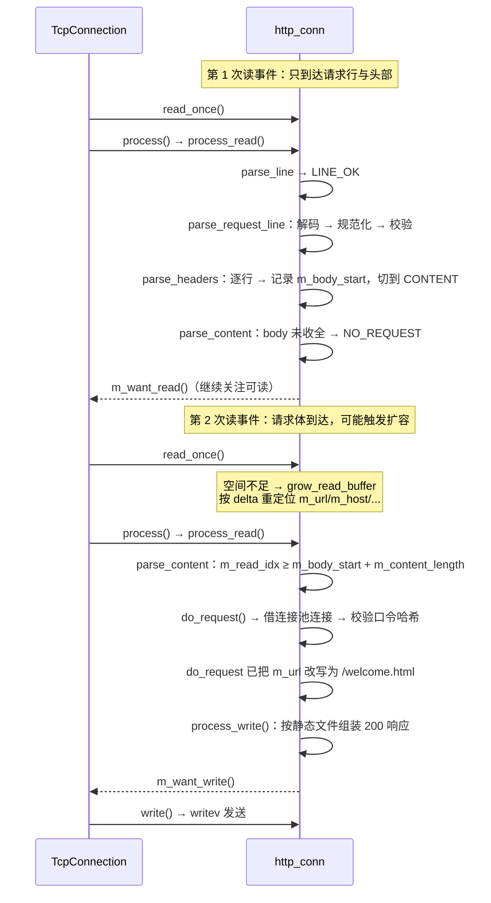

# 06 · 协议实现

> **本章讲什么**：HTTP 报文怎么被解析成请求、请求怎么被路由、响应怎么组装并零拷贝发出。这是全项目最大的一个文件（`http_conn.cpp`，1600 余行），也是安全边界最集中的地方。
>
> **对应源码**：`http/http_conn.{h,cpp}`、`http/url_codec.h`
> **对应记录**：`docs/changes/007`、`008`、`009`、`010`、`012`、`013`、`014`、`015`、`018`、`020`、`033`

---

## 速览

1. **三状态机解析**：请求行 → 头部 → 内容。行由「从状态机」`parse_line()` 切出，切不出完整行就返回 `LINE_OPEN` 等下次读事件——**解析状态因此保存在连接对象里**，必须随连接归属同一线程。
2. **路径处理有一条不可颠倒的顺序：先解码、再规范化。** 先规范化后解码会让 `%2e%2e%2f` 绕过全部路径校验——这是一个**新增绕过途径**的典型错误。
3. **状态码语义被补齐**：区分 `501`（规范定义但未实现的方法）与 `400`（无法识别的记号），补齐 `404` / `413` / `415` / `431` / `417`。
4. **缓冲区从固定改为动态**，随之暴露并修正了三个**只在跨多次读取时才成立**的解析缺陷。
5. **请求体用 `m_body_start` 定界，且内容阶段不再按行扫描**——用游标 `m_checked_idx` 推算请求体位置会在跨读时漂移。
6. **发送是零拷贝的**：静态文件 `mmap` 到内存，`writev` 一次发出「响应头 + 文件正文」两段。
7. **`mmap` + `writev` 这个设计来自原项目**，是被完整保留的最好部分。

---

## 一、S · 背景：原协议层的问题

原实现的解析结构（三状态机）本身是**正确的**，问题出在边界、完整性与安全性上：

| 类别 | 问题 |
|:--|:--|
| **安全** | URL 未解码；静态资源路径**未做规范化与根目录边界校验** → 可读取站点根目录之外的文件 |
| **协议完整性** | 不支持 `HEAD`（解析阶段直接判错）；错误响应的状态码与语义不符；`404` 分支缺失 |
| **健壮性** | 头部长度无校验；`Content-Length` 用 `atol` 解析（`"abc"` 被静默当作 `0`）；参数解析依赖固定偏移 |
| **容量** | 读缓冲固定 2 KB，超出即**关闭连接**（不是拒绝） |
| **功能** | 上传文件写入 `./upload/` 而静态根是 `./root/`，上传后无法访问 |

---

## 二、T · 目标

| 目标 | 说明 |
|:--|:--|
| 正确性 | 边界与错误分支按规范补齐，状态码语义准确 |
| 安全 | 路径不能越出站点根；SQL 不拼接；上传受约束 |
| 容量 | 解除固定缓冲区限制，区分「缓冲满」与「连接关闭」 |
| 完整性 | 支持 `HEAD`、管线化、长连接、`Expect: 100-continue` |

---

## 三、A · 做法

### 3.1 状态机结构

```
        parse_line()  ← 从状态机：在缓冲区里切出一行
              │
   ┌──────────┴──────────┐
   │  LINE_OPEN  行未收完 → 等下次读事件
   │  LINE_BAD   行非法   → 400
   │  LINE_OK    拿到一行 → 交给主状态机
   └──────────┬──────────┘
              ▼
   主状态机 m_check_state
   ├── CHECK_STATE_REQUESTLINE  parse_request_line()
   ├── CHECK_STATE_HEADER       parse_headers()      （逐行）
   └── CHECK_STATE_CONTENT      parse_content()      （不按行）
```

`parse_line()` 找 `\r\n`，找到就**就地把 `\r\n` 改写成 `\0\0`**（便于按 C 字符串处理该行），并推进游标。这个「就地改写」有一个后果值得记住：**缓冲区被改写后无法重新切分出原来的行**——所以「解析出错就从头重来」这条路是走不通的（见 §3.4 的备选方案）。

主状态机里有一处容易写错的地方：请求行的结果**一旦非 `NO_REQUEST` 就是最终结果**，必须立即返回。

```cpp
case CHECK_STATE_REQUESTLINE:
    ret = parse_request_line(text);
    if (ret != NO_REQUEST) return ret;   // 不能只判 BAD_REQUEST
```

只判 `BAD_REQUEST` 是不够的：像 `501 METHOD_NOT_IMPLEMENTED` 这样的取值会被当作「还没解析完」，于是**下一行（例如 `Host` 头）会被当成请求行继续解析**。

### 3.2 路径处理：顺序不可颠倒

这是本章最需要记住的一条。

```cpp
// 解码必须在规范化之前：%2e%2e%2f 解码后才是 '..'，颠倒则绕过路径校验
const std::string decoded = url_codec::decode(m_url, false);

// %00 解码后是字符串结束符，会让后续按 C 字符串处理的逻辑提前截断
if (decoded.find('\0') != std::string::npos) return BAD_REQUEST;

m_url = overwrite_url(m_url, decoded);          // 就地写回（只会变短）
const std::string normalized = url_codec::normalize_path(m_url);
if (normalized.empty()) return BAD_REQUEST;     // 试图越过根目录
m_url = overwrite_url(m_url, normalized);
```

**为什么顺序如此**：`normalize_path` 靠识别 `..` 段来拒绝越界。如果先规范化再解码，那么 `%2e%2e%2f` 这一串在规范化时**还不是** `../`，会被当作普通文件名放行；**解码之后它才变成 `../`**——此时校验已经做完了。结果就是「只加解码、不做规范化」等于**新增了一条绕过途径**。

两个函数都在 [`http/url_codec.h`](../../http/url_codec.h) 里，是**纯字符串变换**（不依赖连接状态与全局配置），因此被提取到头文件中直接单测——路径规范化是安全边界，仅靠端到端测试难以覆盖「编码后被绕过」的输入组合，必须有 10 个用例的单元测试逐项钉住。

另外两处细节：`decode` 只对路径做 `%XX` 还原，**不把 `+` 还原为空格**（那是表单体的约定，路径中的 `+` 是字面量）；非法转义（`%ZZ`、结尾不完整的 `%A`）按字面量保留，而不是报错——这样不会因为一个畸形序列就把正常路径判为非法。

### 3.3 头部校验与状态码语义

**头部校验**（每一项都对应一个真实缺陷）：

| 检查 | 处理 | 为什么 |
|:--|:--|:--|
| 头部长度 | 超过 `MAX_HEADER_SIZE`（8 KB）→ **431** | 此前没有上限 |
| `Host` 缺失 | → **400** | HTTP/1.1 要求请求必须携带 `Host` |
| `Content-Length` 重复 | → **400** | 长度有两种解释，是请求走私的常见手法 |
| `Content-Length` 非十进制数字 | → **400** | `atol` 会把 `"abc"` 静默当作 `0`、把 `"12abc"` 当作 `12` |
| `Content-Length` 超上限 | → **413** | 长度本身就超了，无需再传输请求体 |
| `Expect` 非 `100-continue` | → **417** | 其余期望值本服务端无法满足 |

**状态码语义**：`is_known_method()` 区分「规范定义了但本服务端未实现的方法」（`PUT`/`DELETE`/`TRACE`/`OPTIONS`/`CONNECT`/`PATCH` → **501**，并带 `Allow` 头）与「根本无法识别的请求记号」（→ **400**）。这两者此前都被当成错误请求处理。

**错误响应统一补上 `Content-Type`**：此前这些响应没有任何类型声明，由客户端自行猜测。

### 3.4 动态缓冲与指针重定位

读/写缓冲从固定数组改为 `std::vector<char>` 按需扩容。**这一步解除尺寸限制的同时，暴露了三个原本被固定尺寸掩盖的缺陷**——它们的共同点是**只在请求跨越多次读取时才成立**：

| 缺陷 | 现象 | 修法 |
|:--|:--|:--|
| **请求体起点随读取漂移** | `m_checked_idx` 被 `parse_line` 一路推到读索引处，用它推算的「请求体是否收完」基准随每次读取增长。实测 20 KB 请求体到第 5 轮数据已全到齐，判定基准却涨到 36417 → **请求永远无法完成**，连接挂到超时 | 新增 `m_body_start`，在头部解析完时记录一次；内容阶段**不再调用 `parse_line`** |
| **内容阶段补写结束符破坏后续字节** | `text[m_content_length] = '\0'` 写的位置紧随请求体之后，那里可能正是**流水线中下一个请求**的起始字节 | 去掉这行；消费方都带长度读取，不依赖 C 字符串语义 |
| **扩容后指针失效** | `m_url` / `m_version` / `m_host` / `m_string` 都指向读缓冲内部，`vector` 扩容重分配后全部变成悬垂指针 | `grow_read_buffer` 按同一偏移量重新指向 |

指针重定位的必要性有 ASan 对照：**临时去掉重定位**后，4 KB 跨读请求体在 AddressSanitizer 下立刻报 `heap-use-after-free`，定位到 `do_request` 中读取已失效的 `m_url`。

```cpp
void http_conn::grow_read_buffer(size_t size)
{
    const char *old_data = m_read_buf.data();
    m_read_buf.resize(size);
    const ptrdiff_t delta = m_read_buf.data() - old_data;
    if (delta == 0) return;
    if (m_url != nullptr) m_url += delta;      // 凡指向读缓冲区的成员都要在此调整
    ...
}
```

**备选方案是「扩容后重置解析状态、从头重解析」**，未采用——因为解析过程会**就地改写**缓冲区（`parse_line` 把 `\r\n` 改成 `\0`），缓冲区已被改动后无法重新切分出原来的行。

**超限的处理路径是一处关键取舍**：`read_once` 返回 `false` 的既有含义是「连接该结束了」，而**要在那一刻发出响应，需要同时改动两条调用路径**。因此改为把「超限」表达为一种**解析结果**：`m_oversized` 置位 → `process_read` 返回 `REQUEST_TOO_LARGE` → `process_write` 回应 `413` 并强制 `Connection: close`。这样调用方无需区分。

**连接复用时归还大缓冲**：`reset()` 里若读缓冲容量远大于初始值（> 4 倍）则释放重分配，避免一次大请求之后连接对象长期占着大块内存。但**缓冲里还压着下一个请求的字节时不能缩容**。

### 3.5 长连接、半关闭与 `Expect`

**长连接改为默认。** 原实现只在收到 `Connection: keep-alive` 时才置真，于是**不带该头的客户端**（`curl`、`wrk` 等多数实现）每个请求都要重连。更正为：HTTP/1.1 默认保持连接，只在显式收到 `Connection: close` 时才置假。

**半关闭**：分派顺序与关闭前的判断见 [05](05-生命周期与资源管理.md) §3.6。协议层的配合是 `has_pending_work()`。

**`Expect: 100-continue`**：客户端在发送大请求体前先征求许可。回应时机有讲究——**放在「确定要收这个请求体」的时刻**（头部解析完、`Content-Length` 已校验），而不是解析到 `Expect` 头时立刻发。因为如果长度字段本身已超限（解析 `Content-Length` 时已返回 413），就不该再让客户端开始传数据。

而且 `100 Continue` **不参与写缓冲的组装**：它是一条中间响应，写完即被后续的最终响应覆盖，直接 `send` 即可。

### 3.6 管线化

一个 TCP 段里可能有多个完整请求。`reset()` 在复位状态时**保留已完整解析后剩下的字节**：

```cpp
const size_t leftover = (m_request_parsed && m_read_idx > m_checked_idx)
                        ? static_cast<size_t>(m_read_idx - m_checked_idx) : 0;
if (leftover > 0 && m_checked_idx > 0)
    memmove(m_read_buf.data(), m_read_buf.data() + m_checked_idx, leftover);   // 前移
```

`m_request_parsed` 是「本次是否已完整解析出一个请求」的标志：只有置位后，读缓冲里剩余的字节才**属于下一个请求**；没走完时保留会让同一段被反复重解析。

写路径也要配合——响应发完后立刻检查是否还有待处理的请求：

```cpp
// tcp_connection.cpp  handle_write()
if (m_conn.has_pending_work() && !m_conn.process()) close();
```

否则要等对端再发数据才会动。

### 3.7 上传闭环

原实现把文件写入 `./upload/`，而静态资源根是 `./root/`——**上传后无法通过 HTTP 取回**。补全后的三条路由：

| 请求 | 行为 |
|:--|:--|
| `POST /upload` | 解析 `multipart/form-data`，落盘到 `./upload/` |
| `GET /upload` | 列出已上传文件（动态生成 HTML 列表页） |
| `GET /upload/<名>` | 下载该文件 |

**约束**（每条都有明确理由）：

| 约束 | 取值 | 理由 |
|:--|:--|:--|
| 扩展名白名单 | `.jpg .png .mp4 .txt .pdf .zip` 等 | **不接受 `.html` / `.svg` / `.js`**——它们上传后可在浏览器中执行 |
| 单文件体积上限 | 4 MiB（< 请求体上限 8 MiB） | 请求体还含边界与 part 头部 |
| 文件名剥离路径 | 只取最后一个 `/` 或 `\` 之后的部分 | 防目录穿越 |
| 下载一律加 `Content-Disposition: attachment` | — | 否则可携带脚本的类型会**就地渲染**，构成同源的存储型 XSS |
| 列表页文件名转义 | `html_escape` + `url_encode_segment` | 文件名来自用户，不转义会被当作页面结构 |

**两处边界判定的时机**不同，这个区分值得记：

- **文件名可以提前判定**——part 头部一旦到达，文件名就已可判定。不合格就**立刻**拒绝，否则要等客户端把整个 8 MiB 传完才回 415，白费时间与带宽。
- **体积无法提前判定**——`Content-Length` 是整个请求体的长度，其中还含边界与 part 头部，**请求体未超限并不说明文件未超限**，只能在落盘前校验。

`check_upload_name()` 被两处共用（提前判定与落盘前判定），保证两侧结论一致。

---

## 四、核心链路：一次跨多次读取的 POST

以「带 4 KB 表单请求体的 `POST /2`（登录）」为例，看状态机与缓冲区如何协作：



**注意最后一步**：登录成功不是发 `302` 重定向，而是把 `m_url` **改写**成 `/welcome.html`，再走同一套静态映射逻辑。这是原项目的手法，本项目保留了结构、只加固了参数解析。

---

## 五、关键接口与字段

| 接口 / 字段 | 语义 | 设计要点 |
|:--|:--|:--|
| `parse_line()` | 从状态机，切一行 | 就地改写 `\r\n` 为 `\0\0`；切不出完整行返回 `LINE_OPEN` |
| `process_read()` | 主状态机 | 请求行的结果一旦非 `NO_REQUEST` 必须立即返回 |
| `process_write(ret)` | 按解析结果组装响应 | 每个 `HTTP_CODE` 一个分支；`default` 返回 false 交由上层关闭 |
| `m_check_state` | 当前解析状态 | `REQUESTLINE` / `HEADER` / `CONTENT` |
| `m_body_start` | 请求体起点 | 头部解析完记录一次；**不能**用游标 `m_checked_idx` 推算 |
| `m_request_parsed` | 本次是否已完整解析出一个请求 | 决定 `reset()` 时读缓冲里剩余字节的去留（管线化） |
| `m_has_content_length` | 是否已出现过 `Content-Length` | 重复即 400（请求走私） |
| `m_oversized` | 请求体已超上限 | 把「超限」表达为解析结果，而非读失败 |
| `m_expect_continue` | 是否需回应 100 Continue | 在「确定要收请求体」的时刻才回 |
| `m_iv[2]` / `m_iv_count` | `writev` 的两个段 | `[0]` = 响应头，`[1]` = `mmap` 的文件正文；HEAD 时 `count` 为 1 |
| `m_real_file[200]` | 拼好的实际文件路径 | 一次 `snprintf` 完成，**装不下即判错误请求**（截断的路径并非请求目标） |

---

## 六、R · 结果

### 6.1 行为验证

| 用例 | 结果 |
|:--|:--|
| 4 KB 请求体，先送头部、停顿 0.4 s 再送体（跨两次读取，触发扩容） | 正确路由到主面板 |
| 20 KB 请求体单次送达 | 正常解析 |
| 9 MB 请求体（超 8 MiB 上限） | **413 Request Entity Too Large** |
| 超限之后的其他请求 | 正常返回 200 |
| 未知方法 `PUT` | **501**（实测） |
| 重复 `Content-Length` | 400 |
| 路径 `../` 与 `%2e%2e%2f` | 均被拒绝 |
| 半关闭（发送后立即 `shutdown(SHUT_WR)`） | 4 种触发模式各 **15/15** 成功，正文 md5 与源文件一致 |

### 6.2 指针重定位的必要性（ASan 对照）

| 版本 | 4 KB 跨读请求体在 ASan 下 |
|:--|:--|
| 保留重定位 | 无报告 |
| **临时去掉重定位** | `heap-use-after-free`，定位到 `do_request` 读取已失效的 `m_url` |

### 6.3 内存

| 版本 | 常驻内存 |
|:--|--:|
| 固定缓冲 | 264 MB |
| 动态缓冲 | **76 MB** |

剩余部分是连接对象数组本身，由 [05](05-生命周期与资源管理.md) 的连接对象按需化解决（→ 12.6 MB）。

---

## 七、通用知识

**HTTP 与协议实现**

- **HTTP/1.1 报文结构**：请求行 / 头部 / 空行 / 请求体；**行以 `\r\n` 结束**（`\n` 单独出现要按非法处理）
- **HTTP/1.1 的默认长连接**与 `Connection: close` 的语义
- **`Host` 头是 HTTP/1.1 的强制要求**
- **`Content-Length` 的解析必须严格**：非数字要报错，不能用 `atol` 静默吞掉
- **重复 `Content-Length` 与请求走私**的关系
- **`Expect: 100-continue`** 的用途与回应时机
- **`Transfer-Encoding: chunked`** 是尚未支持的一项（见 [12 · 附录](12-附录.md) 的遗留清单）
- **常用状态码的语义边界**：`400`（语法错）vs `501`（规范定义但未实现）vs `405`（方法不允许）；`413` / `415` / `431` / `417`

**Web 安全**

- **路径穿越与 URL 编码绕过**：`%2e%2e%2f`、`%00` 截断；**解码必须先于规范化**
- **存储型 XSS**：用户上传的内容若可就地渲染即可执行；对策是扩展名白名单 + `Content-Disposition: attachment`，而不是只依赖前端转义
- **响应头注入**：头部取值必须过滤控制字符与引号
- **HTML 转义与 URL 编码**的适用场景不同：前者用于展示，后者用于链接
- **SQL 注入**与参数化查询（详见 [07 · 安全加固](07-安全加固.md)）

**C++ 系统编程**

- **`std::vector` 扩容导致地址变化**：任何指向其内部的裸指针/引用都会失效，必须重定位——这是「对象内部持有指向自身缓冲的指针」这种设计的固有代价
- **`vsnprintf` 的返回值语义**：截断时返回「本该写入的长度」，据此判断是否扩容重试；**重试前必须 `va_copy`**，被消费过的 `va_list` 不能再次使用
- **`std::string_view` 避免拷贝**：解析大请求体时只取视图，不复制整份
- **`mmap` + `writev` 零拷贝发送**：`iovec` 数组描述「头部 + 正文」两段，一次系统调用发出
- **`writev` 部分写**的处理：`EAGAIN` 时转去关注可写；推进 `iovec` 时**必须先判「是否已发完」**，否则会在未设置的 `iov` 上做越界指针运算（HEAD 响应就踩过这个坑）

---

## 八、延伸阅读

| 想深入了解 | 去看 |
|:--|:--|
| URL 解码与路径规范化 | [changes/009](../changes/009-url-decode-and-path-normalization.md) |
| 错误响应与状态码语义 | [changes/010](../changes/010-error-response-status-codes.md) |
| 动态缓冲与跨读解析修正 | [changes/013](../changes/013-dynamic-buffers.md) |
| HEAD 方法与头部校验 | [changes/014](../changes/014-head-and-header-validation.md) |
| 上传闭环与约束 | [changes/015](../changes/015-upload-loop-and-limits.md) |
| 长连接、半关闭与 Expect | [changes/018](../changes/018-audit-fixes-batch2.md) 、[changes/020](../changes/020-keepalive-and-halfclose.md) |
| 表单解析与 SQL 参数化 | [changes/008](../changes/008-form-parsing-and-sql-params.md) |
| 访问控制的完整设计 | [07 · 安全加固](07-安全加固.md) |

---

**下一章**：[07 · 安全加固](07-安全加固.md) —— 口令为什么不能明文存、SQL 为什么不能拼接、上传为什么要限制类型，以及这三处各自的实现。
