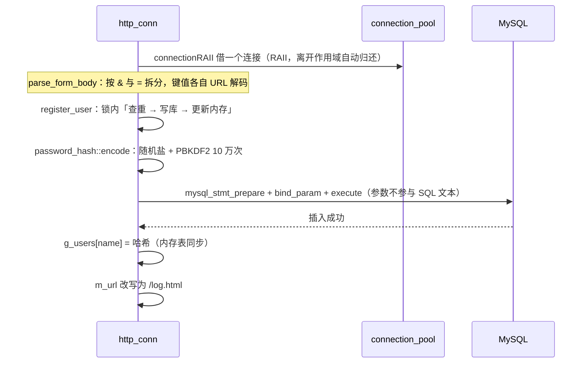

# 07 · 安全加固

> **本章讲什么**：原项目里有三处属于同一类的问题——**把「数据」当成了「代码」**。口令被当成普通字符串比对、用户输入被拼进 SQL 语句、请求路径被直接拼进文件路径。本章讲这三处各自的成因与对策。
>
> **对应源码**：`auth/password_hash.{h,cpp}`、`CGImysql/sql_connection_pool.{h,cpp}`、`http/http_conn.cpp` 的登录注册与上传部分
> **对应记录**：`docs/changes/008`、`009`、`012`、`015`

---

## 速览

1. **三处问题可以归成一句**：**信任了外部输入**。口令被明文存储与直接比对、用户名被拼进 SQL 文本、请求路径被直接拼进文件路径。
2. **口令改用加盐哈希**：PBKDF2-HMAC-SHA256，10 万次迭代、每条 16 字节随机盐。存储格式 `算法$迭代次数$盐$散列`——**把迭代次数写进记录**是关键设计，日后提高代价参数不会让既有记录失效。
3. **校验用定长比较**（`CRYPTO_memcmp`），耗时与匹配前缀无关；**明文记录一律判为不匹配**，这一点由单元测试固化。
4. **既有明文数据自动迁移**：启动时逐行检查，是明文就升级为哈希。实测 80 条记录 4.15 秒（约 52 ms/行），升级后库中**明文行数 80 → 0**。
5. **SQL 改为参数化**：用户名与口令经 `mysql_stmt` 绑定传递，不再拼进 SQL 文本。
6. **上传与下载的约束**：扩展名白名单（排除 `.html`/`.svg`/`.js`）、体积上限、下载一律 `Content-Disposition: attachment`（防存储型 XSS）。

---

## 一、S · 背景：三处同一类的问题

### 1.1 命令/查询注入的原型

安全漏洞里有一大类叫**注入**，共同形态是：程序把**外部输入**和**指令**混在同一个字符串里解析，于是输入中的特殊字符被当成了指令的一部分。三种常见形态在本项目里各有一例：

| 形态 | 外部输入 | 被当成指令的部分 | 原实现 |
|:--|:--|:--|:--|
| **SQL 注入** | 用户名 / 口令 | SQL 语法 | 拼接字符串构造查询 |
| **路径穿越** | 请求路径 | 文件系统路径 | 直接拼接站点根目录 |
| **跨站脚本（XSS）** | 上传的文件内容 / 文件名 | HTML 结构 | 上传内容可就地渲染；列表页不转义 |

### 1.2 口令存储：不是注入，但同样是「信任了数据」

口令的问题略有不同——它不是注入，而是**把「应当单向不可逆」的东西当成了普通数据**：

```cpp
// 注册
strcat(sql_insert, password);                          // 明文入库
users.insert(std::pair<std::string,std::string>(name, password));

// 登录
if (lookup_user(name, stored) && stored == password)   // 明文比对
```

三个后果：

1. **库一旦泄露，口令立即可用**——备份泄露、只读账号被滥用、日志或快照被带走，都能直接拿到口令。而用户普遍复用口令，影响会扩散到其他系统
2. **即便换成哈希，若无盐**，相同口令会产生相同散列，彩虹表与「一次破解、多处复用」依然有效
3. **列宽不够**：`passwd` 是 `char(50)`，哈希串比明文长，直接改哈希会写入失败

---

## 二、T · 目标

| 目标 | 手段 |
|:--|:--|
| 库中不存口令本身 | 加盐哈希；**既有明文自动迁移**，升级后库中不留明文 |
| 输入不参与语法 | SQL 参数化；路径先解码再规范化并校验边界 |
| 用户内容不能执行 | 扩展名白名单 + 下载一律按附件 + 输出转义 |

---

## 三、A · 做法

### 3.1 口令：从明文到加盐哈希

**算法与参数**（`auth/password_hash.cpp`）：

| 参数 | 取值 | 理由 |
|:--|:--|:--|
| 算法 | **PBKDF2-HMAC-SHA256** | 专门为口令设计的**慢哈希**，OpenSSL 原生提供 |
| 迭代次数 | **100000** | 把单次校验抬到几十毫秒量级，让离线穷举不可行 |
| 盐 | 每条 **16 字节**随机数 | 相同口令在库中呈现不同散列 |
| 推导长度 | **32 字节** | SHA-256 的输出长度 |

**存储格式**：

```
pbkdf2_sha256$100000$<base64 盐>$<base64 散列>
```

字段以 `$` 分隔——base64 字母表中不含 `$`，按它切分是安全的。

> **把迭代次数写进记录**是这里最关键的一个设计：日后若要提高代价参数，只需改常量，**既有记录仍按各自记录的次数校验**，无需一次性重算全表。这相当于给存储格式留了一个向前兼容的演进位。

**备选方案**是系统 `crypt_r`（`$6$` SHA-512）。它的优点是不引入源码依赖；但盐长与迭代次数由系统约定、可调性差，且不同 libc 的实现存在差异。既然构建已经依赖 MySQL 客户端库，再引入 OpenSSL **不增加部署复杂度**，因此选了参数完全可控的 PBKDF2。

**校验的两处细节**：

```cpp
// 1) 定长比较：不因首个不同字节而提前返回，比较耗时与匹配前缀长度无关
return CRYPTO_memcmp(expected.data(), key.data(), expected.size()) == 0;

// 2) 记录里的迭代次数必须被使用，且要有上界
if (end == iterations_text.c_str() || *end != '\0'
    || iterations <= 0 || iterations > kMaxIterations) return false;
```

第二点的上界（10000000）是防止**被篡改的记录让校验陷入长时间计算**。还有一条规则：**不是本模块编码格式的存储值一律返回 `false`**——也就是说 `verify("123456", "123456")` 必须为假，**明文记录不能被判为匹配**。这条在单元测试里单独固化了。

**迁移：启动时一次性升级**。

```
加载用户表
  ├─ 确保 passwd 列足够宽（不足则 ALTER TABLE ... MODIFY passwd VARCHAR(255)）
  └─ 逐行检查
       ├─ 已是哈希 → 直接载入内存
       └─ 仍是明文 → 计算哈希 → UPDATE 回库 → 载入内存
```

两处值得说明的判断：

- **列宽自动加宽**：旧表的 `char(50)` 存不下哈希串。若不处理，失败会**推迟到注册或迁移写入时才暴露**——那时错误现场离根因很远。因此先查 `information_schema` 确认列宽，不足则 `ALTER`
- **迁移失败即终止启动**：若某个账号升级失败却继续运行，该账号会带着明文留在内存里而校验永远不通过，表现为「**口令正确却登录失败**」——这比启动失败更难定位

启动期的致命错误用 `fprintf(stderr, ...)` 而非 `LOG_ERROR`，因为**日志开关可能被关闭**（`-c 1`）。

### 3.2 SQL 参数化

原来的写法是把用户名与口令**拼进 SQL 文本**。改为预处理语句：

```cpp
MYSQL_STMT *stmt = mysql_stmt_init(conn);
mysql_stmt_prepare(stmt, sql, strlen(sql));
StringBinder binder(2);
binder.set(0, first);
binder.set(1, second);
mysql_stmt_bind_param(stmt, binder.data());
mysql_stmt_execute(stmt);
```

这样做之后，`name` 里无论出现引号、注释符还是分号，**都只是一段数据**，不参与 SQL 语法解析。

**一个小小的 C++ 陷阱值得单独记**：`MYSQL_BIND` 的 `length` 成员是**指针**。如果直接指向一个临时变量，那个变量出了作用域就成了悬垂指针。所以 `StringBinder` 把绑定数组和长度变量**放在同一个对象里一起持有**：

```cpp
class StringBinder
{
    void set(size_t index, const std::string &value)
    {
        m_lengths[index] = value.size();
        m_binds[index].length = &m_lengths[index];   // 指向自己持有的成员，不是临时变量
        ...
    }
    std::vector<MYSQL_BIND> m_binds;
    std::vector<unsigned long> m_lengths;            // 与 binds 同生命周期
};
```

> 这是「**加一层薄封装消除样板**」的典型场景：三处绑定代码若各写一遍，每处都要自己维护一份长度变量的生命周期，而**只要有一处写错就是悬垂指针**。封装之后，两处调用点各缩短为一行。

**顺带修掉的一处并发问题**：用户表（`g_users`）此前是「**写侧加锁、读侧裸读**」——不对称的同步。现在读写都收敛到加锁的 `lookup_user()` / `register_user()`。注册还在**锁内**完成「查重 → 写库 → 更新内存」的完整序列，使判重与插入之间**不存在竞态窗口**。

### 3.3 路径穿越与上传约束

这两处属于协议层的实现，详细顺序与代码见 [06 · 协议实现](06-协议实现.md) §3.2 与 §3.7。这里只列安全结论：

| 项 | 对策 | 为什么 |
|:--|:--|:--|
| **路径穿越** | 先解码 `%XX`，再规范化，越界即拒 | **顺序不可颠倒**：先规范化后解码会让 `%2e%2e%2f` 绕过全部校验 |
| **`%00` 截断** | 解码结果含 `\0` 即拒 | 路径随后按 C 字符串处理，含结束符的内容会在那里被截断 |
| **上传类型** | 扩展名白名单，**排除 `.html`/`.svg`/`.js`** | 它们上传后可在浏览器中执行 |
| **上传体积** | 单文件 4 MiB（< 请求体上限 8 MiB） | 请求体还含边界与 part 头部 |
| **下载** | 一律 `Content-Disposition: attachment` | 否则可携带脚本的类型会**就地渲染**，构成同源的存储型 XSS |
| **文件名** | 剥离路径（只取最后一个分隔符之后） | 防目录穿越 |
| **列表页** | `html_escape` + `url_encode_segment` | 文件名来自用户，不转义会被当作页面结构 |
| **响应头** | `sanitize_header_value` 过滤控制字符与引号 | 防响应头注入 |

> **注意「下载加 `attachment`」和「扩展名白名单」是两件事**，缺一不可：白名单限制**能传什么**，`attachment` 限制**取回时怎么用**。只做白名单的话，一个合法的 `.svg` 仍可能在浏览器里执行脚本。

---

## 四、核心链路：一次注册写库



**注意 `connectionRAII` 这一层**：它是一个作用域守卫，构造时从池里借、析构时归还。这正是 [05 · 生命周期与资源管理](05-生命周期与资源管理.md) 里说的 RAII——这里它用得很合适，因为「借用」的生命周期恰好就是**一次请求处理的作用域**。

---

## 五、关键接口与字段

| 接口 / 字段 | 位置 | 语义 | 设计要点 |
|:--|:--|:--|:--|
| `encode(password)` | `password_hash` | 生成加盐哈希串 | 每条随机盐；失败返回空串由调用方判定 |
| `verify(password, encoded)` | `password_hash` | 校验 | 迭代次数**取自记录**且有上界；定长比较；非本格式一律 false |
| `is_encoded(stored)` | `password_hash` | 判断是否已是哈希 | 迁移时用它区分「已升级」与「仍明文」 |
| `kIterations` | `password_hash` | 10 万次 | 随散列一同存储，调整它不会让既有记录失效 |
| `kMaxIterations` | `password_hash` | 1000 万次上限 | 防止被篡改的记录让校验陷入长时间计算 |
| `connectionRAII` | `sql_connection_pool` | 借还连接的作用域守卫 | 构造借、析构还，与请求处理的作用域对齐 |
| `GetConnection()` | `connection_pool` | 取一个连接 | **锁内**读链表；取不到就 `post` 回信号量，保持计数一致 |
| `StringBinder` | `http_conn.cpp`（匿名命名空间） | 持有绑定数组与长度变量 | `MYSQL_BIND::length` 是指针，必须指向同生命周期的变量 |
| `g_users` / `g_users_lock` | `http_conn.cpp`（匿名命名空间） | 进程内用户表 | 读写都经加锁封装，消除「写加锁、读裸读」的不对称 |

---

## 六、R · 结果

### 6.1 迁移与登录（80 条明文记录实测）

| 项 | 结果 |
|:--|:--|
| 列定义 | `char(50)` → `varchar(255)` |
| 明文行数 | **80 → 0** |
| 迁移耗时 | **4.15 s**（约 52 ms/行，与单次 PBKDF2 推导耗时一致） |
| 无明文可迁移时的启动耗时 | 0.56 s |
| 二次启动 | 不重复升级、不再执行 `ALTER`，**幂等** |
| 原明文口令登录 | 正常登录 |
| 错误口令 | 被拒 |
| 新注册 | 库中记录为 `pbkdf2_sha256$…`，**不含明文** |

### 6.2 单元测试（`password_hash_tests`，7 组）

| 组 | 覆盖内容 |
|:--|:--|
| 编码格式 | 字段数、算法名、盐与散列非空 |
| 盐的随机性 | 相同口令两次编码结果不同，但都能通过校验 |
| 口令匹配 | 正确通过；错一位、大小写不同、空口令均不通过 |
| **明文不可通过** | `verify("123456","123456")` 为假 |
| 畸形存储值 | 空串、无分隔符、字段不足、算法不符、迭代次数非数字/为 0/为负/过大、散列长度不对齐 |
| **迭代次数取自记录** | 把记录中的次数改为 1000 后校验失败——若实现固定用常量则会误判为通过 |
| 边界口令 | 空口令与 1000 字符口令均能正确编码与校验 |

第 6 组尤其值得记：它专门验证「**参数确实来自记录而不是写死的常量**」——这类断言只有想清楚了实现可能怎么错才写得出来。

---

## 七、通用知识

**口令与密码学**

- **为什么不能明文存口令**：库泄露即口令可用的连锁反应
- **为什么必须加盐**：相同口令不应产生相同散列；彩虹表与跨系统复用
- **为什么用慢哈希而不是 SHA-256**：普通哈希太快，离线穷举可行；PBKDF2 / bcrypt / scrypt / Argon2 是专门为口令设计的
- **`CRYPTO_memcmp` 与定长比较**：避免比较耗时泄漏前缀信息
- **参数随记录存储**：给存储格式留向前兼容的演进位
- **OpenSSL 的常用 API**：`RAND_bytes`、`PKCS5_PBKDF2_HMAC`、`EVP_Digest*`、`EVP_EncodeBlock` / `EVP_DecodeBlock`

**注入类漏洞**

- **SQL 注入的成因与参数化查询**：`mysql_stmt_prepare` + `bind_param`；为什么参数不参与语法解析
- **路径穿越与编码绕过**：`%2e%2e%2f`、`%00` 截断；**解码与规范化的顺序**
- **存储型 XSS**：用户上传内容可就地渲染时的风险；白名单 + `attachment` + 输出转义三者配合
- **响应头注入**：头部取值必须过滤控制字符

**C++ 与并发**

- **`MYSQL_BIND::length` 是悬垂指针的经典来源**：绑定的长度变量必须与绑定数组同生命周期
- **薄封装消除样板**：把「容易写错的重复代码」收敛成一个类，风险从 N 处降到 1 处
- **RAII 作用域守卫**（`connectionRAII`）：把「借还」与作用域绑定
- **同步策略必须对称**：写侧加锁、读侧裸读，等于没加锁

**工程判断**

- **失败要尽早、要显式**：列宽不足宁可启动时 `ALTER`，也不要拖到写入时才报错；迁移失败宁可终止启动，也不要留下「口令正确却登录失败」的怪现象
- **如实记录遗留**：口令强度未校验、无失败频次限制、无修改/重置流程——这些都写进了遗留清单（见 [12 · 附录](12-附录.md)），而不是存在于「没写就等于没有」的状态

---

## 八、延伸阅读

| 想深入了解 | 去看 |
|:--|:--|
| 口令哈希的设计、迁移与验证 | [changes/012](../changes/012-password-hashing.md) |
| 表单解析与 SQL 参数化 | [changes/008](../changes/008-form-parsing-and-sql-params.md) |
| URL 解码与路径规范化 | [changes/009](../changes/009-url-decode-and-path-normalization.md) |
| 上传闭环与约束 | [changes/015](../changes/015-upload-loop-and-limits.md) |
| 协议层的完整安全边界 | [06 · 协议实现](06-协议实现.md) |
| 遗留问题的当前状态 | [12 · 附录](12-附录.md) |

---

**下一章**：[08 · 日志系统](08-日志系统.md) —— 同步与异步两种写入的语义差别、缓冲池批量落盘为什么把吞吐提升了四倍，以及「背压可见」是什么意思。
