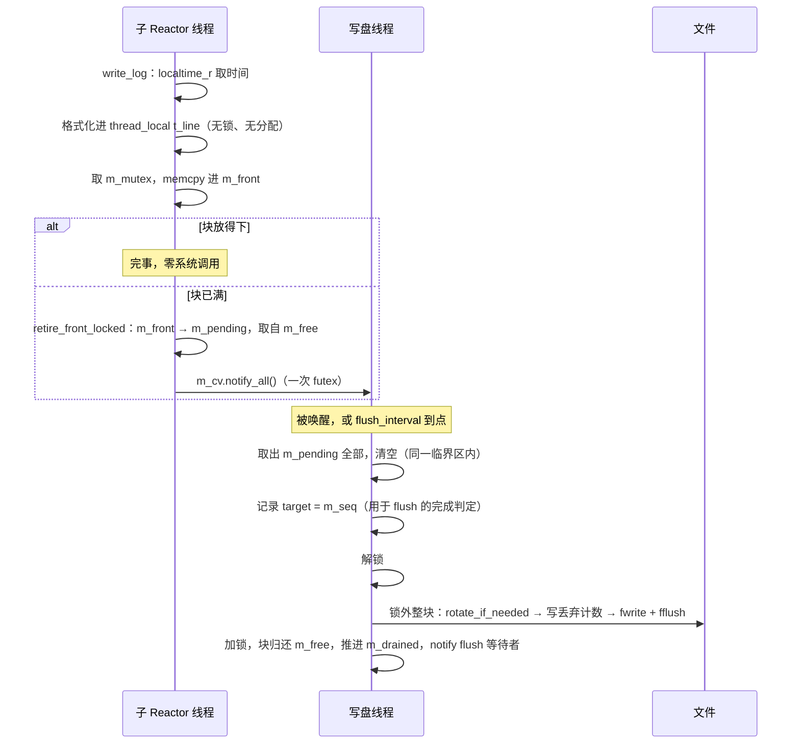

# 08 · 日志系统

> **本章讲什么**：日志在请求路径上被大量调用（**单次静态页面请求约 23 行**），因此它的写入代价会直接反映在吞吐上。本章讲怎么把「每行落盘」改成「按块落盘」，以及为什么这件事能把开日志时的吞吐提升四倍。
>
> **对应源码**：`log/log.{h,cpp}`
> **对应记录**：`docs/changes/030`、`007`

---

## 速览

1. **日志的写入路径在热路径上**：`process_read` 每解析一行请求行或头部记一条，`add_response` 每次追加写缓冲也记一条——单次静态请求约 **23 行**。
2. **旧实现每写一行要付三笔代价**：`LOG_*` 宏每行调一次 `flush()`（即**每行一次 `fflush`**）；`write_log` 每行取锁三次；文件轮转（`fclose` + `fopen`）也在**调用线程持锁**进行。
3. **代价直接反映在吞吐上**：开启日志要付出约**四成**吞吐，而旧的异步方式在 `-t 2` 下**甚至比同步更慢**——它的队列与锁的开销超过了它省下的写调用。
4. **改造的核心是「把落盘单位从一行变成一整块」**：调用线程只把整行日志 `memcpy` 进一块线程共享的缓冲，专门的写盘线程按块落盘。写入路径上**没有系统调用、没有内存分配**。
5. **效果**：异步方式 `-t 2` 下 **9157 → 36209 QPS（约 4.0 倍）**，每行日志的写系统调用降到约 **1/4.3**，CPU 时间降到约 **1/3.1**。
6. **背压可见**：写盘跟不上时**丢弃新行并计数**，由写盘线程在文件里写下一行「已丢弃 N 行日志」——**丢失可见，而不是无声无息**。
7. **代价**：崩溃时最多丢一个 `flush_interval`（默认 1 秒）的日志。优雅退出仍完整落盘。

---

## 一、S · 背景：旧实现每行要付三笔代价

```
旧实现的一行日志：
  LOG_INFO(...)  →  write_log
      ├─ 取锁：轮转判断
      ├─ 取锁：格式化到共享缓冲
      ├─ 取锁：写文件
      └─ flush()  →  fflush        ← 每行一次系统调用
```

三笔代价：

| 代价 | 说明 |
|:--|:--|
| **每行一次 `fflush`** | `LOG_DEBUG/INFO/WARN` 宏内都调 `flush()` |
| **每行取锁三次** | 轮转判断、格式化、写文件各一次；异步路径还有阻塞队列的 `full()` 与 `push()` 各一次锁加一次 `broadcast` |
| **轮转在调用线程** | `fclose` + `fopen` 也持锁进行，一次轮转就会挡住所有写日志的线程 |

**实测结果印证了这个分析**：旧的异步方式在 `-t 2` 下 QPS 只有 **9157**，**比同步方式的 15792 还低**。异步本来是为了把写入代价从调用线程移走，结果它的队列与锁的开销反而超过了省下的写调用——**这是「加了机制却没解决根因」的典型**。

---

## 二、T · 目标

| 目标 | 手段 |
|:--|:--|
| 写入路径上没有系统调用 | 调用线程只 `memcpy` 进内存块，落盘交给专门的线程 |
| 写入路径上不分配内存 | 缓冲池在 `init` 时一次性分配，此后不再申请 |
| 语义分层清晰 | 同步 = 「写入即落盘」；异步 = 「按块批量落盘」，两者差别收敛为「写盘线程在不在」 |
| 不丢得无声无息 | 写不过来时丢弃并**计数**，由写盘线程把丢失写成文件里的一行 |

---

## 三、A · 做法

### 3.1 为什么是「缓冲池」而不是「两块缓冲」

常见写法是 front / back 两块。但块写满之后要么丢弃、要么排队，**一旦排队就需要一个空闲块的来源**，池化是必然结果；此时「备用块」已经等同于「空闲栈里的任意一块」，再单列一个 `m_back` 只会引入需要额外推理的状态。

因此采用**三个角色**：

| 角色 | 说明 |
|:--|:--|
| `m_front` | 当前写入块 |
| `m_pending` | 已写满、等待落盘，**先进先出**。**有且只有写盘线程会取走它**——这就是「文件内容的顺序等于写入顺序」的保证所在 |
| `m_free` | 空闲块 |

池大小固定为 **9 块**（1 块当前写入 + 8 块可排队），内存上界即 `9 × batch_buf_size`。池在 `init` 时一次性分配，三个指针数组一并预留容量，此后**写入与落盘路径都不再分配**。

### 3.2 写入路径

```
1. 取时间（localtime_r）
2. 把时间前缀与内容格式化进「线程私有的定长缓冲」
3. 取一次锁，memcpy 进 m_front
     ├─ 放得下 → 完事
     └─ 放不下 → 换块 + 唤醒写盘线程
                 └─ 池中没有空闲块 → 丢弃并计数（背压）
```

**第 2 步为什么用编译期定长的数组，而不是按配置扩容的容器？** 这是个值得记的取舍：容量若取决于运行期配置，第 2 步就得**无锁读一个会被 `init` 改写的量**（数据竞争），或者为它加锁——两条路都堵死。把 `buf_size` 夹到 `[128, 4096]` 并固定数组容量，问题就不存在了：

```cpp
thread_local char t_line[Log::MAX_LINE_BUF];    // 容量编译期确定
```

**措辞要准确**：写入路径**没有系统调用、没有内存分配**，但**并非零成本**——取时间、格式化仍在，且换块时那次唤醒通常是一次 futex。唤醒**只在换块时做**，逐行唤醒会把刚省下的系统调用又按行加回来。

### 3.3 落盘、轮转与背压

写盘线程在「**缓冲块写满**」或「**到达 `flush_interval`**」时醒来，把 `m_pending` 整体取出，**在锁外**整块 `fwrite`。轮转（按天、按行数）也在这里做，位于排空之后以保证顺序。

**背压的判据取「池中没有空闲块」**——它与「待写队列超长」等价，但**直接对应真正要约束的内存**。触发时丢弃新行并计数，由写盘线程在下一次落盘时写成一行：

```
2026-10-02 20:41:07.123456 [warn]: 已丢弃 18432 行日志（落盘速度跟不上写入）
```

这里**不同步写盘**：旧的异步实现在队列满时由**调用线程**直接落盘，把一次磁盘写压在 Reactor 线程上——**正是这次要消除的东西**。

### 3.4 同步方式为什么不做缓冲

同步方式的语义是「**写入即落盘**」。若让它也走缓冲池，多个 Reactor 线程各自排空时会出现「取块」与「写文件」之间的窗口，**块的落盘顺序可能与写入顺序相反**。改为每行直接写文件、由同一把文件锁串行化，顺序即取得锁的顺序。

因此两种方式的差别收敛为一句话：**写盘线程在不在**。运行期的分支判断依据是 `m_writer_active` 而不是配置项，同步方式便不再有第二处语义。

### 3.5 其它取舍

| 取舍 | 决定 | 理由 |
|:--|:--|:--|
| `init` 的参数 | 改用具名字段的结构体 `LogConfig` | 取值里有**五个是 int**，相邻两个写反编译器不报错，运行期只表现为「某个配置没生效」 |
| `split_lines` | 改为**软**上限 | 判据是「整块写下去会不会越过」，文件可能多出不到一块的行数；换来写盘侧**只做整块写出**，不必按行切分或维护行偏移表 |
| 日切判据 | 取年、月、日三者，且按**块内首行**的时刻 | 旧实现只比 `tm_mday`，跨月同日（8-05 到 9-05）**不会切分** |
| `LOG_ERROR` | 保留一次 `flush()` | 错误行是排障时最不能丢的；而按间隔批量落盘意味着崩溃时最多丢一个间隔。错误路径罕见，开销在微秒级 |
| 配置项 | 删除 `queue_size`，新增 `batch_buf_size` 与 `flush_interval` | **破坏性变更**：`Config` 对无法识别的键硬报错，沿用旧配置会启动失败并**明确提示** |

### 3.6 两把锁

| 锁 | 保护 | 谁用 |
|:--|:--|:--|
| `m_mutex` | 缓冲池（`m_front` / `m_pending` / `m_free` / 序号） | 所有写日志的线程 + 写盘线程 |
| `m_file_mutex` | **文件位置**（`m_fp`、行数、轮转状态） | 写盘线程、同步模式下的调用线程 |

**两把锁从不同时持有**（锁序规定）。后者的意义是把「**同一时刻只有一个写文件的人**」变成**结构约束而非约定**——两种写入方式都经 `write_batch` 进这把锁，将来即便出现第三种排空者也不会写坏文件。

---

## 四、核心链路：一行日志的生命周期



**三处细节值得单独看**：

1. **取 `target` 的时机**：必须在**取走待写队列的同一个临界区内**捕获。若改用排空结束时的 `m_seq`，期间新入队的块会被**误报为已落盘**。
2. **`m_drained` 用 `max` 推进**：只有真正完成排空的线程推进它，且不让它倒退。
3. **`flush()` 的循环**：池满时 `retire` 会失败，因此 `flush()` 要**反复「唤醒—等待—再试」**，而不是等一次就返回——否则 `m_front` 里还留着的行会被漏掉。

---

## 五、关键接口与字段

| 接口 / 字段 | 语义 | 设计要点 |
|:--|:--|:--|
| `write_log(level, fmt, ...)` | 写入一行 | 未初始化时直接返回，不取锁、不格式化、不碰文件 |
| `flush()` | 排空并等落盘完成 | 供进程退出与单元测试用；池满时要循环重试 |
| `init(const LogConfig&)` | 初始化 | **可重复调用**：先停上一个写盘线程、排空并关闭上一个文件 |
| `m_front` / `m_pending` / `m_free` | 缓冲池三角色 | 池大小固定 9 块，内存上界确定 |
| `m_seq` / `m_drained` | 入队序号 / 已落盘序号 | `flush()` 的完成判定依据 |
| `m_dropped` | 丢弃行数（`atomic`） | 背压记账，由写盘线程写成文件里的一行 |
| `m_line_cap` | 夹取后的单行上限（`atomic`） | **热路径无锁读**它，故须是 `atomic` |
| `m_ready` | 是否已初始化（`atomic`） | `write_log` 与 `flush` 先读它，避免启动期错误路径写日志 |
| `t_line` | `thread_local` 定长格式化缓冲 | 容量编译期确定，否则热路径要无锁读会被 `init` 改写的量 |
| `Batch::first_sec` | 块内**首行**的时间戳 | 日切按它判定，而不是按落盘时刻 |
| `MAX_PENDING_BLOCKS` | 待写队列上限（8） | 与「池中没有空闲块」等价 |

---

## 六、R · 结果

### 6.1 改造前后对比（开启日志）

同一环境、同一时段，`-m 0`，100 并发，5 秒一组取中位数：

| 写入方式 | 改动前 `-t 2` | 改动后 `-t 2` | 改动前 `-t 8` | 改动后 `-t 8` |
|:--|--:|--:|--:|--:|
| 同步 | 15792 | 14496 | 17403 | 16789 |
| 异步 | **9157** | **36209** | 24523 | 24053 |

- **异步 `-t 2` 提升约 4.0 倍**（9 次重复的区间为 28125~39216），P50 从 **10.690 ms** 降到 **2.620 ms**，P99 从 **22.410 ms** 降到 **5.790 ms**
- **同步基本持平**（−8%，落在 ±10% 噪声内）——符合预期，它按设计仍是每行一次写入
- **异步 `-t 8` 与改动前持平且方差很大**，且明显低于 `-t 2`

最后一条本身是个有价值的发现：8 个子 Reactor + 1 个写盘线程共 10 个线程跑在 4 个逻辑核上，**超过核数之后日志的互斥量成为争用点**。这是「**批量落盘下线程数并非越多越好**」的一个可观测事实。

### 6.2 每行日志的成本

`-t 2`，读 `/proc/<pid>/io` 与 `/proc/<pid>/stat`：

| 组 | QPS | 每行写调用 | 每行 CPU tick |
|:--|--:|--:|--:|
| 改动前 · 同步 | 16507 | 0.385 | 0.00041 |
| 改动前 · 异步 | 9375 | 0.195 | 0.00072 |
| 改动后 · 同步 | 14503 | 0.392 | 0.00048 |
| 改动后 · 异步 | **36632** | **0.045** | **0.00023** |

每行日志的写系统调用降到约 **1/4.3**，CPU 时间降到约 **1/3.1**。同步方式的每行成本与改动前**一致**——这印证了**收益全部来自「不再逐行落盘」**，而不是别的东西。

**还有一条最该守住的性质**：改造前后的**每请求日志行数一致**（23.1 → 23.2），说明调用点的行为未因改造而变化。

### 6.3 单元测试（12 例）

| 用例 | 判据 |
|:--|:--|
| `LineNeverExceedsBufferSize` | 行长不超上限；**ASan 下不报越界**——这类越界不改变可观测输出，只能靠 ASan |
| `AsyncFlushesOnIntervalWithoutExplicitFlush` | **不调用 `flush()`**，写盘线程按间隔自行落盘 |
| `AsyncDoesNotWriteBeforeFlush` | 间隔远大于用例时长且只写一行时，文件仍为空——**批量而非逐行** |
| `ConcurrentLinesAreIntactAndOrdered` | 4 线程 × 2000 行：行数相符、每行完整、同一线程自身序号严格递增 |
| `RepeatedInitDoesNotLeakFd` | 20 次 `init` 后 `/proc/self/fd` 条目数不增长 |
| `RotationPreservesOrder` | 各后缀文件按序拼接后，行序列与写入序列**完全一致** |
| `BackpressureAccountIsBalanced` | 核对守恒式「普通行 + 丢弃 = 写入」，并确认丢弃路径**确实被走到** |

轮转、背压、并发这三条都用**探针**确认过路径确实被走到——例如轮转用例实际切出了 11 个文件；背压用例最初参数不足以触发丢弃，调整到「单行取上限、块取最小值」后三次探测的丢弃率均在 92% 上下。

> **「用探针确认路径真的被走到」**是这里最值得学的做法：一个测「背压」的用例，如果负载根本触发不了背压，它就会**永久通过**而毫无价值。

---

## 七、验证中发现的两处问题

这一节的两个问题都不是「代码写错」，而是**更隐蔽的一类**，值得单独记。

### 7.1 实现缺陷：定时醒来没处理未满的块

改造后的第一版里，写盘线程醒来**只排空 `m_pending`（已写满的块）**，没有处理 `m_front` 里未满的那一块。而定时刷新的意义恰恰是「**块没满但已经等够久了也要落盘**」。后果是异步方式下日志长期留在内存：冒烟测试里跑了三次请求、等过一个刷新间隔，**文件仍是空的**。

### 7.2 为什么测试没发现它——测试把错误行为当成了正确断言

当时那条用例断言的是「**未调用 `flush()` 时文件应为空**」——它把**错误行为**写成了正确断言，于是**通过了**。

补上的 `AsyncFlushesOnIntervalWithoutExplicitFlush` 才是对的判据：不调用 `flush()`，按间隔等待后内容**必须可见**。该用例在去掉修正后立即失败，确认有效。

> **这是本章最值得记住的一条**：一个断言「什么都不发生」的测试，可能同时通过于「行为正确」与「功能完全没实现」。**断言应该写成「某件事必须发生」，而不是「某件事没有发生」**——至少不要只用后者。

### 7.3 顺带修掉的三处既有缺陷

改造中的参数夹取顺带修掉了三处，它们都由**配置取值**触发，现有测试从未覆盖：

| 缺陷 | 表现 | 证据 |
|:--|:--|:--|
| `snprintf(m_buf, 48, ...)` | 缓冲区只有 `buf_size` 字节，而时间前缀固定按 48 字节写；`buf_size < 48` 时是**堆越界写** | ASan 在 `buf_size = 16` 下报 `heap-buffer-overflow`，写入 36 字节到 16 字节的堆块 |
| 同一处的算术 | `n` 与前后的长度参数都基于 `m_log_buf_size` 作差，取值过小时 `n` 变负，指针与长度一并下溢 | 与上一条同源 |
| `init` 重复调用不 `fclose` | 每次 `init` 都重新 `fopen`，上一份文件句柄泄漏 | 单测直接以 `/proc/self/fd` 的条目数核对 |

### 7.4 TSan 在日志模块的成片误报

TSan 在日志模块报出 **31 条数据竞争与 1 条重复加锁**，覆盖 `m_mutex` 保护下的几乎每一处访问。

**判据**：**同一互斥量保护下的两处访问被报成竞争**——这本身不自洽，说明工具记错了锁的归属。

验证方法：写一个**不含任何 `Log` 代码**的最小程序（`mutex` + `condition_variable` + 写线程），逐一替换等待写法：

| 等待写法 | TSan 报告数 |
|:--|--:|
| `wait_for` 带谓词 / 不带谓词 / `wait_until` / `pthread_cond_clockwait` | 各 3 |
| **`wait` 带谓词（无超时）** | **0** |
| 解锁 + `sleep_for` + 加锁 | **0** |

再把 `writer_loop` 里那处定时等待临时换成轮询（语义等价、仅用于实验），**报告数归零、12 个用例仍全过**，而实现本身不变。

**结论**：本工具链（GCC 11 的 libstdc++ 与 libtsan）在处理**带超时的条件变量等待**时会把互斥量的持有状态记错。考虑轮询会引入真实的落盘延迟与更多丢弃，**保留 `wait_for`**，并在源码与架构文档里留下指引，避免后来者去追这个幽灵。

> 这一条与 [06](06-协议实现.md) 里「ASan 干净不等于没有内存问题」是同一类教训：**知道每种工具查不了什么，和知道它能查什么同样重要**。

---

## 八、通用知识

**日志系统设计**

- **同步 vs 异步日志的语义差别**：同步 = 写入即落盘（崩溃不丢），异步 = 批量落盘（崩溃最多丢一个刷新间隔）
- **批量落盘为什么有效**：把 N 次写系统调用合并为 1 次
- **双缓冲 / 缓冲池的取舍**：一旦需要排队，池化就是必然结果
- **背压最小可见化**：丢弃 + 计数 + 写出丢弃行，优于静默丢弃，也优于把写压回调用线程
- **文件轮转的判据**：按日切要取年月日三个字段（只比 `tm_mday` 跨月不触发）；行数上限设为「软」可以换来落盘侧只做整块写出
- **写盘线程只应有一个**：这是「文件内容顺序 = 写入顺序」的保证

**并发编程**

- **`std::condition_variable::wait_for` 带谓词**：`notify` 早于 `wait` 也不丢唤醒
- **`thread_local` 消除锁**：线程私有缓冲让格式化路径无锁
- **`std::atomic` 用于热路径的无锁读**（`m_line_cap`、`m_ready`）
- **用序号 + 条件变量表达「排空完成」**：`m_drained >= target`；目标序号必须在取队列的同一临界区内捕获
- **锁的次序约定**：两把锁从不同时持有；把「同时只有一个写文件的人」变成结构约束
- **`std::max` 推进单调量**：防止并发下回退

**工程方法**

- **断言要写成「必须发生」**：断言「什么都不发生」的测试可能通过于「功能完全没实现」
- **用探针确认测试路径真的被走到**：触发不了背压的背压测试毫无价值
- **优化要能归因**：同步方式每行成本不变，才说明收益确实来自「不再逐行落盘」
- **配置项是缺陷的温床**：多处堆越界都由「取值过小」触发，应定下区间并在启动阶段拦下
- **工具误报要有判据、有最小复现、有取舍结论**，而不是简单地「加个忽略注释」

---

## 九、延伸阅读

| 想深入了解 | 去看 |
|:--|:--|
| 双缓冲改造的完整设计与数据 | [changes/030](../changes/030-log-double-buffer.md) |
| 日志模块的说明 | [log/README.md](../../log/README.md) |
| TSan 误报的判据 | [architecture.md](../architecture.md) 第七节 |
| 进程退出时如何排空日志 | [05 · 生命周期与资源管理](05-生命周期与资源管理.md) |
| 工程基础与验证体系 | [09 · 工程基础](09-工程基础.md) |

---

**下一章**：[09 · 工程基础](09-工程基础.md) —— 构建系统、代码规范、单元测试、CI 与动态检查，以及「为什么改代码之前要先建好这些」。
