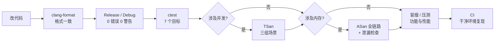

# 09 · 工程基础

> **本章讲什么**：构建系统、代码规范、单元测试、持续集成、动态检查。这些东西本身不实现任何功能，但**决定了后面所有改动能不能被验证**。本章还讲一条重要原则：**为什么改代码之前要先建好这些**。
>
> **对应文件**：`CMakeLists.txt`、`.clang-format`、`tests/`、`.github/workflows/ci.yml`、`config.{h,cpp}`、`build.sh`
> **对应记录**：`docs/changes/001`~`006`、`011`、`032`、`033`

---

## 速览

1. **改造前的状态是「改代码等于盲改」**：手写 Makefile 只有一条编译规则，**未声明语言标准**，无告警开关，依赖硬编码为 `-lmysqlclient`，无法接入 Sanitizer，且**全量编译**。
2. **构建系统换成 CMake**，并**显式把 Release 固定为 `-O2 -DNDEBUG`**——CMake 默认用 `-O3`，而性能基线以 `-O2` 采集；不固定的话，后续所有性能对比都会混入优化级别的差异。
3. **开启 `-Wall -Wextra` 后报出 45 个告警**，治理到 0。其中两类涉及真实行为：`return-type`（14 个，函数缺返回值）与 `stringop-truncation`（6 个，字符串截断风险）。
4. **单元测试用 GoogleTest，共 7 个测试目标**；其中 `event_loop_tests` 与 `timer_queue_tests` 会真的跑起事件循环、跨线程投递任务。
5. **CI 用 GitHub Actions，矩阵跑 Release 与 Debug 两种配置**——因为两套编译选项不同（Release 带 `-DNDEBUG`），**某些依赖断言的代码路径只在其中一种下才暴露问题**。
6. **动态检查有三种，能力边界各不同**：ASan 查内存访问错误、valgrind 查未初始化值、TSan 查数据竞争。**知道每种工具查不了什么，和知道它能查什么同样重要**（见 [03](03-并发模型重构.md) §8.2 的实际案例）。
7. **ASan 全链路跑出一个由日志改造引入的回归**：`SIGTERM` 退出码变成 143。它**不产生任何报错输出**——如果只盯着「有没有 ASan 报告」，就会把「检查根本没跑」误当成「检查通过」。

---

## 一、S · 背景：没有基础设施时的状态

原项目的构建方式是手写 Makefile：

```makefile
server: main.cpp ./timer/lst_timer.cpp ./http/http_conn.cpp ./log/log.cpp \
        ./CGImysql/sql_connection_pool.cpp webserver.cpp config.cpp
	$(CXX) -o server $^ $(CXXFLAGS) -lpthread -lmysqlclient
```

一条规则，五个局限：

| 局限 | 后果 |
|:--|:--|
| **未声明语言标准** | 编译行为依赖编译器默认值，换编译器可能变 |
| **无告警开关** | 编译器发现的问题**全部被静默丢弃** |
| **依赖硬编码** | `-lmysqlclient` 写死在规则里，未做探测 |
| **无法接入 Sanitizer** | 内存与并发错误只能靠肉眼与运气发现 |
| **全量编译** | 改动任一文件都重编全部，反馈慢 |

再叠加「没有测试、没有 CI」，状态就是：**改一行代码，没有任何机制能告诉你改对了还是改坏了**。

---

## 二、T · 目标

| 目标 | 手段 |
|:--|:--|
| 改动可验证 | 单元测试 + `ctest` 一键运行 |
| 环境干净可复现 | CI 在全新机器上从零构建 |
| 代码质量有下界 | `-Wall -Wextra` 零告警 + `clang-format` 统一格式 |
| 内存与并发正确性可查 | ASan / TSan / valgrind |
| 配置不写死在源码里 | 三层配置来源 |

**一个重要的排序原则**：这些事**全部发生在架构重构之前**。理由很直接——**在缺少验证手段的状态下改并发架构，等于闭着眼睛做手术**。而且工程基础的改动（构建、格式、命名空间、`const`）与并发架构**互不相干**，先做完就不会在后面的重构里返工。

---

## 三、A · 做法

### 3.1 构建系统：CMake

选 CMake 的理由：依赖探测交给 `pkg-config`（不硬编码库名与路径）、构建类型与自定义选项是一等公民、后续接入测试只需 `add_subdirectory`、是 C++ 生态的事实标准。

**一个容易被忽略的关键配置**：

```cmake
# CMake 的 Release 默认使用 -O3，而性能基线以 -O2 采集，
# 保持两者一致才能让后续的性能对比只反映代码改动本身。
set(CMAKE_CXX_FLAGS_RELEASE "-O2 -DNDEBUG")
```

> **不固定优化级别的话，后面所有性能对比都会混入优化级别的差异。** 这类「污染对比前提」的细节，正是「先建基线、再优化」这套方法能成立的前提。

其它配置：`CMAKE_CXX_STANDARD 17` 搭配 `CXX_STANDARD_REQUIRED ON` 与 `CXX_EXTENSIONS OFF`（禁用 GNU 扩展，保证可移植性）；`-Wall -Wextra`；`ENABLE_ASAN` / `ENABLE_TSAN` 两个开关（**二者互斥**，同时开启直接 `FATAL_ERROR`）。

### 3.2 代码规范与告警治理

**语言标准**：迁移到 C++17。迁移前先确认代码未使用 C++17 移除的特性（`register`、`throw()`、`auto_ptr`），检索结果为空，因此**迁移无需改动任何源码**——这也是「先验证再动手」的一次实践。

**格式**：引入 `clang-format` 与 `.clang-format` 配置，全项目统一；配套加 `.git-blame-ignore-revs`，避免格式化提交污染 `git blame`。

**开启 `-Wall -Wextra` 后报出 45 个告警**：

| 类型 | 数量 | 是否涉及行为 |
|:--|--:|:--|
| `return-type` 函数缺少返回值 | 14 | **是** |
| `unused-parameter` 未使用参数 | 8 | 否 |
| `stringop-truncation` 字符串截断风险 | 6 | **是** |
| `unused-variable` 未使用变量 | 5 | 否 |
| `sign-compare` 有符号与无符号比较 | 3 | 潜在 |
| `reorder` 成员初始化顺序 | 3 | 潜在 |
| `format-truncation` 格式化截断风险 | 3 | 潜在 |
| `unused-result` / `unused-but-set-variable` / `implicit-fallthrough` | 各 1 | 潜在 |

> **这条值得单独记**：45 个告警里，**只有 20 个涉及真实行为**，其余是清理项。但这 20 个里包括「函数缺返回值」这种**在 Release 下行为不确定**的缺陷——它们此前一直被静默丢弃。**开告警的收益不是「代码更整洁」，而是「暴露出真实的缺陷」。**

**其它规范项**：移除头文件中的全局 `using namespace std`（改用显式限定）、不安全 C 字符串函数换成 `std::string` 与有长度约束的接口、只读方法补 `const`、区分「开发期断言」与「运行时错误处理」（后者原本用 `assert`，在 Release 下会**被移除**）。

### 3.3 单元测试

用 GoogleTest，接入 CMake 与 `ctest`，**共 7 个测试目标**：

| 目标 | 覆盖 |
|:--|:--|
| `unit_tests` | 并发原语（互斥量、条件变量、信号量） |
| `log_tests` | 日志缓冲边界、顺序、排空、轮转、背压（12 例） |
| `url_codec_tests` | URL 解码与路径规范化（10 例） |
| `config_tests` | 配置解析 |
| `password_hash_tests` | 口令哈希（7 组） |
| `event_loop_tests` | 事件循环（8 例，**真的跑起循环并跨线程投递**） |
| `timer_queue_tests` | 定时器队列与 signalfd（6 例） |

**两处值得学的做法**：

1. **给会挂住的测试加超时**。`event_loop_tests` 与 `timer_queue_tests` 设 `TIMEOUT 30`，`log_tests` 设 `TIMEOUT 120`（后者含并发与大批量写入，在 Sanitizer 下会慢一个数量级）。原因是这类测试的失败模式可能是**挂住**——把 `wakeup()` 临时改成空函数后，两个用例立即挂住，说明它们确实在验证唤醒；但「挂住」不是好的失败模式，CI 里会一直卡着。**加超时是为了把它变成一次可读的失败，不是随手设的保险。**
2. **测试抽出纯函数**。路径规范化是安全边界，仅靠端到端测试难以覆盖「编码后被绕过」的输入组合，因此把 `decode` / `normalize_path` 提取为不依赖连接状态的纯函数，直接单测 10 个用例。

### 3.4 持续集成

GitHub Actions，触发条件是「推送到 `main`」与「向 `main` 提交 PR」，五步：检出 → 装依赖 → 配置 CMake → 编译（`-j$(nproc)`）→ `ctest --output-on-failure`。

**矩阵跑 Release 与 Debug 两种配置**，这个设计有实际价值：

> 两种配置的编译选项不同（Release 带 `-DNDEBUG`），**某些依赖断言的代码路径只在其中一种下才会暴露问题**。前面告警治理中发现的「断言在 Release 下被移除」正是这类差异。

**`--output-on-failure` 是关键细节**：不加它，测试失败时只能看到一行失败提示，拿不到具体断言信息。

CI 解决的是两个具体问题：**干净环境验证**（本地可能残留未被察觉的隐式依赖，只有全新机器上从零构建才能暴露）与**自动回归保护**（测试「写了但没人跑」等于没写）。

### 3.5 动态检查：三种工具，三种能力

| 工具 | 查什么 | 查不了什么 |
|:--|:--|:--|
| **ASan**（AddressSanitizer） | 越界访问、use-after-free、内存泄漏 | **语义错误**（如 `munmap` 了不属于自己的合法地址）、未初始化值 |
| **valgrind memcheck** | **未初始化值的使用**、越界、泄漏 | 慢 10~30 倍，高并发下调度失真 |
| **TSan**（ThreadSanitizer） | 数据竞争、死锁 | 带超时的条件变量等待会**成片误报**（见 [08](08-日志系统.md) §7.4） |

**本项目对三者的实际使用**：

- **ASan**：单元测试 + **服务端全链路**（静态资源、站点根、404、URL 转义、HEAD、路径穿越、上传闭环、**注册登录含写库**、空闲回收；外加长连接与短连接风暴两组并发）
- **valgrind**：定位崩溃根因（[03](03-并发模型重构.md) §8.3 的一击命中）
- **TSan**：连接建立/关闭风暴、空闲超时与主动关闭并发、日志跨线程写入三组场景

**ASan 全链路的结果，以及「0 字节输出」为什么可采信**：

| 项 | 结果 |
|:--|--:|
| 功能冒烟 | **18/18 通过** |
| 并发长连接 | 32964 req/s |
| 并发短连接（连接风暴） | 22394 req/s |
| ASan / LSan 输出 | **0 字节** |
| `SIGTERM` 退出码 | **0** |

ASan 在无问题时**不产生任何输出**，所以「0 字节」既可能是「干净」，也可能是「检查没跑」。为排除后者，用一个**故意泄漏的最小程序**在同样环境下做了对照——它被如实报告了 1234 字节泄漏且退出码为 1。**因此那份空输出是「检查过、且干净」。**

> 这正是 [08](08-日志系统.md) 里那条教训的另一种形式：**「什么都没发生」的观察，需要一条对照才能解释。**

### 3.6 配置外置

数据库口令等原先硬编码在源码里。改为**三层来源**，优先级由低到高：

```
内置默认值  <  配置文件（config.ini）  <  命令行参数
```

几个设计决定：

| 决定 | 理由 |
|:--|:--|
| `config.ini` 被 `.gitignore` 忽略 | 口令等本地取值不进仓库 |
| **无法识别的键直接终止启动** | 否则「改了配置却没生效」不易察觉 |
| `-f` 显式指定的文件不存在 → 终止 | 多半是路径写错，不该静默回退到默认值 |
| 未给 `-f` 且文件不存在 → 用默认值 | 允许无配置文件运行 |
| **取值范围在启动阶段一次性校验** | 端口、连接数、线程数、日志各项越界即报错，而不是静默截断 |

**最后一条在实践里反复奏效**——[08](08-日志系统.md) §7.3 的三处堆越界，全部由「配置取值过小」触发。**配置项是缺陷的温床，因为它的取值组合几乎不可能被穷举测试。**

---

## 四、一次改动的完整验证链条

把这些设施串起来看，一次改动要过的关卡是：



**这套链条的价值在于「每一层能拦下不同种类的问题」**：格式问题被 `clang-format` 拦下、编译问题被告警拦下、逻辑问题被单测拦下、并发问题被 TSan 拦下、内存问题被 ASan 拦下、环境依赖问题被 CI 拦下。

---

## 五、关键项速查

**构建选项**

| 选项 | 作用 |
|:--|:--|
| `-DCMAKE_BUILD_TYPE=Release` | `-O2 -DNDEBUG`（显式固定） |
| `-DENABLE_ASAN=ON` | AddressSanitizer |
| `-DENABLE_TSAN=ON` | ThreadSanitizer（与 ASAN 互斥） |
| `-DBUILD_TESTING=OFF` | 关闭单元测试（不装 GoogleTest 时用） |

**配置来源**（`config.ini` 的节）

| 节 | 内容 |
|:--|:--|
| `[server]` | 端口、触发模式、线程数、日志开关、站点根目录 |
| `[database]` | 主机、端口、用户、口令、库名、连接池大小 |
| `[log]` | 写入方式、目录与文件名、单行上限、行数上限、缓冲块大小、刷新间隔 |

---

## 六、过程中查出的问题

### 6.1 优雅退出失效（由日志改造引入）

第一次跑 ASan 全链路时，`SIGTERM` 的**退出码是 143（被信号杀死）**，而不是 0。

这个现象**本身不会产生任何 ASan 报告**，只是让泄漏检查**静默地不执行**。

**定位**：用写入方式做对照——

| 写入方式 | 是否有写盘线程 | `SIGTERM` 退出码 |
|:--|:--|--:|
| 0（同步） | 无 | **0** |
| 1（异步，默认） | 有 | **143** |

**根因**：信号掩码是**线程属性**，子线程继承的是创建它那一刻的掩码，因此 `SIGTERM` 必须在创建**任何**线程之前屏蔽。代码里这句约束本来就有注释，但**日志改造把默认写入方式改成了异步，写盘线程在 `WebServer::log_write()` 里就建好了，早于 `run()` 中的屏蔽**——于是它带着未屏蔽的掩码，`SIGTERM` 被投递给它时按默认动作终止进程。

**修法**：把 `block_signals` 从 `run()` 移到 `main()` 开头（配置解析之前）。

> **教训：验证项要挑那些「失败时不会吵闹」的。** 退出码 143 不产生任何报错输出，若这次只跑冒烟、不看退出码与泄漏报告，这个回归会一直留着。
>
> 这也说明**「测试通过」与「检查真的执行了」是两件事**。

### 6.2 全项目审核查出的结构性问题

四个阶段收口后另做了一次**不限于清单**的全项目审核（`033`），查出 8 处缺陷。除功能缺陷外，还列出了一批**结构清理项**：`lock/locker.h` 中的死代码、`GetFreeConn()`、`LogConfig::close_log`、`Channel::m_revents`、`TcpConnection::fd()/peer()` 等未被使用的接口，以及 `sem` 的隐式拷贝赋值、`http_conn.cpp` 职责混杂。

**这批项至今仍未处理**——它们不影响正确性，但被**如实记入了遗留清单**，而不是存在于「没写就等于没有」的状态（见 [12 · 附录](12-附录.md)）。

---

## 七、R · 结果

| 项 | 改造前 | 改造后 |
|:--|:--|:--|
| 构建 | 手写 Makefile，全量编译 | CMake，增量编译，多配置 |
| 语言标准 | 未声明 | C++17，禁用 GNU 扩展 |
| 编译告警 | **45 个被静默丢弃** | **0**（`-Wall -Wextra`） |
| 格式 | 不统一 | `clang-format` 全项目一致 |
| 单元测试 | 无 | **7 个目标** |
| CI | 无 | Release + Debug 矩阵，每次推送执行 |
| 动态检查 | 无 | ASan 全链路 / TSan 三场景 / valgrind |
| 配置 | 硬编码在源码 | 三层来源，越界即报错 |

---

## 八、通用知识

**构建与工具链**

- **CMake 的基本用法**：`cmake -B build` + `cmake --build build`；`CMAKE_CXX_STANDARD`、`target_compile_options`、`find_package` / `pkg_check_modules`
- **构建类型与优化级别**：`-O2 -DNDEBUG`；**为什么性能对比必须固定编译选项**
- **`-Wall -Wextra` 与 `-Werror`**；常见告警类型及其对应的真实缺陷
- **`clang-format` 与 `.git-blame-ignore-revs`**

**测试与验证**

- **单元测试框架 GoogleTest**、`ctest` 与 CMake 的集成、测试超时的意义
- **把纯函数抽出来单测**：安全边界类的逻辑不应只靠端到端覆盖
- **ASan / TSan / valgrind 各自的适用场景与盲区**（这是面试里很有区分度的一点）
- **「检查没跑」与「检查通过」的区别**：用对照组证明检查确实生效
- **CI 的价值**：干净环境验证 + 自动回归

**工程判断**

- **先建验证设施，再改架构**：没有回归保障的架构重构风险极高
- **与架构无关的改动前置**：避免在后续重构中返工
- **配置项是缺陷的温床**：取值组合无法穷举，必须有范围校验
- **静默的失败最危险**：无法识别的配置键、非零的退出码、无输出的检查——都要显式化
- **如实记录未处理项**：把「结构清理」这类不做也不影响正确性的项写进清单，与「忘了」区分开

---

## 九、延伸阅读

| 想深入了解 | 去看 |
|:--|:--|
| 构建系统迁移与告警治理 | [changes/001](../changes/001-build-system.md)、[003](../changes/003-warning-cleanup.md) |
| 单元测试接入 | [changes/005](../changes/005-unit-tests.md) |
| 持续集成 | [changes/006](../changes/006-ci.md) |
| 配置外置 | [changes/011](../changes/011-externalized-configuration.md) |
| ASan 全链路与优雅退出回归 | [changes/032](../changes/032-asan-full-chain.md) |
| 全项目审核查出的问题 | [changes/033](../changes/033-audit-fixes.md) |
| 性能数据的采集方法 | [10 · 性能度量](10-性能度量.md) |
| 遗留问题的当前状态 | [12 · 附录](12-附录.md) |

---

**下一章**：[10 · 性能度量](10-性能度量.md) —— 基线怎么建、同时段 A/B 为什么是唯一可靠的形式、以及「优化必须连同代价一起讲」。
